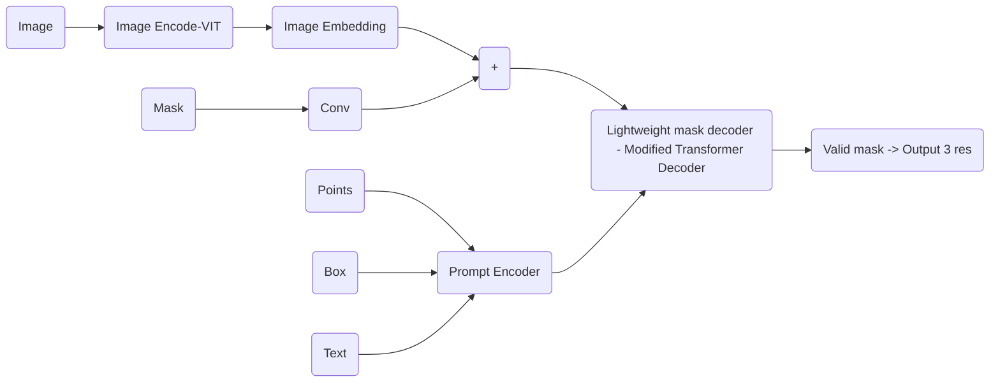
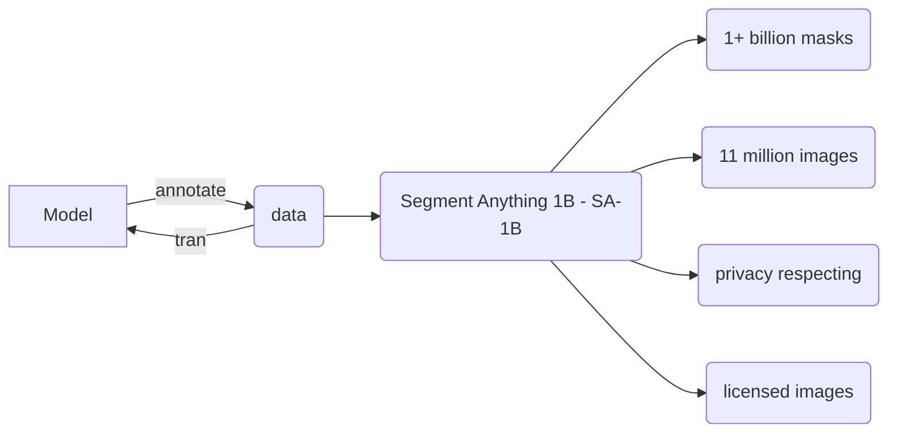
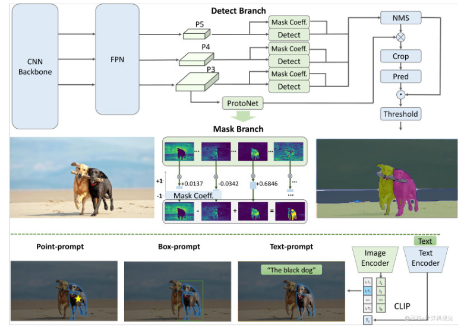

# 1. SAM Info
仓库：https://github.com/facebookresearch/segment-anything  
DEMO：https://segment-anything.com/

## 1.1 SAM Arch


## 1.2 Data Engine


1. Stage1: Assisted-Manual
   1. 120K -> 4.3M masks
2. Stage2: Semi-Automatic
   1. masks 44-> 72
   2. extra 180K -> 5.9M masks
3. Stage3: Fully-Automatic 
   1. 32 * 32 point - SAM -> SA-1B dataset
   2. train data -> 11M pic -> 1.1B high-quality mask 

## 1.3 use
1. Auxiliary annotation(辅助标注)
2. remove backgroud
3. AR/VR/MR

## 1.4 install
```shell
# use LLm
conda create -n sam_env python=3.8
# pytorch>=1.7 torchvision>=0.8
pip install git+https://github.com/facebookresearch/segment-anything.git
```


# 2. Fast SAM
仓库： https://github.com/CASIA-IVA-Lab/FastSAM.git  

## Whay Fast SAM
因为SAM用于计算image embedding的image encoder计算很耗时，可以使用一些平替版SAM，如FastSAM：

FastSAM主要分为两阶段：
1. 基于CNN架构的分割网络：实际使用的是`YOLOv8-seg`（具有分割分支网络的目标检测器）
2. 基于prompt输出对应的分割MASK




并且FastSAM只选择了2%的SA-1B数据集进行训练，在NVIDIA RTX 3090上，推理速度大概是SAM的50倍。

# code install 
```shell
git clone https://github.com/CASIA-IVA-Lab/FastSAM.git
cd FastSAM
pip install -r requirements.txt -i https://pypi.tuna.tsinghua.edu.cn/simple
python setup.py install

pip install git+https://github.com/openai/CLIP.git
# or 
cd CLIP
pip install -e . -i https://pypi.tuna.tsinghua.edu.cn/simple

```


