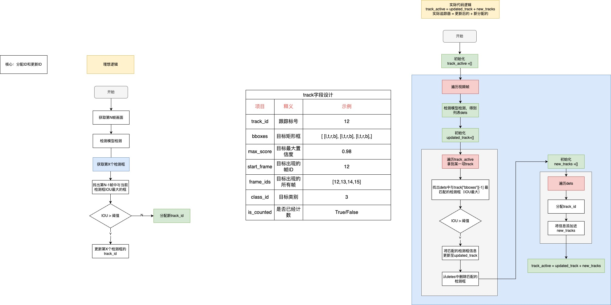

参考：YOLOV8官网要求torch>=1.7.0  
最新版：https://pytorch.org/get-started/locally/  
历史版本：https://pytorch.org/get-started/previous-versions/

# 1- install & verify
```shell
pip install ultralytics==8.0.145
pip install labelImg

cd ./verify_env 
python verify_demo.py
```

## Docker
```shell
# 拉取官方镜像
docker pull ultralytics/ultralytics:latest

# 也可以拉取Pytorch镜像，重头开始安装：
# 参考地址：https://catalog.ngc.nvidia.com/orgs/nvidia/containers/pytorch/tags
docker pull nvcr.io/nvidia/pytorch:22.03-py3 


# 启动镜像：
# --gpus 使用GPU
# -v  C:\XXX:/app 目录映射（将主机目录挂载到容器内部）
sudo docker run -it --ipc=host \
    --gpus all \
    -v  /home/scc/sccWork/myGitHub/My_Learn/AIToys/YoloV8Toy:/app \
    -v  /home/scc/Downloads/AIToy/P2_Yolov8CarCount/1.verify_env:/data \
    ultralytics/ultralytics:latest

# 你可以直接使用命令行，为了方便编辑，可以使用vs code 连接
# 安装 vs code 插件：ms-vscode-remote.remote-containers
# 连接上后就当成普通Linux主机使用即可

# 测试，Docker无法打开窗口界面，可以保存为视频文件
python video_writer.py

systemctl stop docker
```
error fix 
```shell
# E: Unable to locate package nvidia-container-runtime
curl -s -L https://nvidia.github.io/nvidia-docker/gpgkey | \
sudo apt-key add -
distribution=$(. /etc/os-release;echo $ID$VERSION_ID)
curl -s -L https://nvidia.github.io/nvidia-docker/$distribution/nvidia-docker.list | \
sudo tee /etc/apt/sources.list.d/nvidia-docker.list

apt-get install nvidia-container-runtime
systemctl restart docker
```

# 2- LabelImg
## 2.1 data Prepare


```shell
. 工作路径
├── datasets
│   └── custom_dataset
│       ├── images
│       │   ├── train
│       │   │   └── demo_001.jpg
│       │   └── val
│       │       └── demo_002.jpg
│       └── labels
│           ├── train
│           │   └── demo_001.txt
│           └── val
│               └── demo_002.txt
└── 其他文件、文件夹
```
- txt: 标签-yolo格式

## 2.2 create dataset.yaml
> VisDrone2019.yaml
> reference: https://docs.ultralytics.com/datasets/detect/
```yaml
# Train/val/test sets as 1) dir: path/to/imgs, 2) file: path/to/imgs.txt, or 3) list: [path/to/imgs1, path/to/imgs2, ..]
path: ../datasets/coco8  # dataset root dir
train: images/train  # train images (relative to 'path') 4 images
val: images/val  # val images (relative to 'path') 4 images
test:  # test images (optional)

# Classes (80 COCO classes)
names:
  0: person
  1: bicycle
  2: car
  # ...
  77: teddy bear
  78: hair drier
  79: toothbrush
```
## 2.3 choose model
> reference: https://docs.ultralytics.com/tasks/detect/

# 3- train

```shell
# yolo detect train 使用YOLO检测模型，训练模式
# data=VisDrone2019.yaml 数据集信息（路径、类别）
# model=weights/yolov8n.pt 使用的模型
# epochs=100 imgsz=800 workers=4 batch=16 训练参数：100个epoch、输入图像大小、数据加载线程数、Batchsize大小

# n模型
yolo detect train data=VisDrone2019.yaml model=weights/yolov8n.pt epochs=100 imgsz=800 workers=4 batch=16 project=VisDrone2019 name=n_100_800

# m模型
yolo detect train data=VisDrone2019.yaml model=weights/yolov8m.pt epochs=100 imgsz=800 workers=4 batch=16 project=VisDrone2019 name=m_100_800
```
# 4- test verify

YOLO官网推荐使用：https://www.comet.com  
- 去官网注册账号；
- 使用`pip install comet_ml`安装包；
- 运行`comet init --api-key 输入秘钥`（粘贴时不可见，获取：https://www.comet.com/account-settings/apiKeys）
配置存储位置：~/.comet.config
- 打开网站即可查看训练进展。

```shell

# n模型
yolo predict model=VisDrone2019/n_100_800/weights/best.pt source=./test.jpg

yolo detect val data=VisDrone2019.yaml \
model=VisDrone2019/n_100_800/weights/best.pt
```

# 5- tracker
> 追踪任务是指识别和跟踪特定目标在视频序列中的运动和位置（一般用唯一ID或固定颜色检测框表示），如下面示例视频

## 5.1 IOU
> 比较前后两帧检测框IOU是否大于指定阈值，是则是同一个物体，不是则分配新ID




## 5.2 卡尔曼滤波
> 卡尔曼滤波是一种用于估计系统状态的优秀算法。它结合了传感器测量和系统模型，通过递归地计算加权平均值，实时更新状态估计。卡尔曼滤波在众多领域，如导航、机器人技术和信号处理中广泛应用，以提高系统的准确性和鲁棒性。
我们用的库：https://github.com/adipandas/multi-object-tracker


fix code
```shell
# 下载源代码： git clone https://github.com/adipandas/multi-object-tracker.git

#进入到multi-object-tracker目录，运行下列命令重新安装：
pip install -e .

# 对于项目中所有运行需要获取track的示例，调用方式由
frame_num, id, bb_left, bb_top, bb_width, bb_height, confidence, x, y, z = track
# 改为：
frame_num, id, bb_left, bb_top, bb_width, bb_height, confidence, x, y, z, class_id = track

```

```python
# 主要修改点
# motrackers/track.py，函数get_mot_challenge_format，将第112行
mot_tuple = (
  self.frame_id, self.id, self.bbox[0], self.bbox[1], self.bbox[2], self.bbox[3], self.detection_confidence,
  -1, -1, -1
)
# 改为：
mot_tuple = (
  self.frame_id, self.id, self.bbox[0], self.bbox[1], self.bbox[2], self.bbox[3], self.detection_confidence,
  -1, -1, -1, self.class_id
)

# 函数get_vis_drone_format，将134行
mot_tuple = (
  self.frame_id, self.id, self.bbox[0], self.bbox[1], self.bbox[2], self.bbox[3],
  self.detection_confidence, self.class_id, -1, -1
)
# 改为
mot_tuple = (
  self.frame_id, self.id, self.bbox[0], self.bbox[1], self.bbox[2], self.bbox[3],
  self.detection_confidence, self.class_id, -1, -1, self.class_id
)

```

## 5.3 botsort&bytetrack
> BoT-SORT：https://github.com/NirAharon/BoT-SORT  
ByteTrack ：https://github.com/ifzhang/ByteTrack

example
```python
# 命令行方式
# bytetrack
yolo track tracker="bytetrack.yaml"  model=yolov8n.pt source=test.mp4 conf=0.3, iou=0.5 show
# botsort
yolo track tracker="botsort.yaml"  model=yolov8n.pt source=test.mp4 conf=0.3, iou=0.5 show

```


# 6- Project
> 目标：车辆经过指定直线（下图黄线），记录经过数量；

1. 预处理图像：
   1. 使用labelme（`pip install labelme`）划定非监测区域（如下图中绿色停车场区域）
      1. may need delete: `cv2/qt/plugins`
   2. 划定越界直线
   3. 使用`labelme_draw_json proj2_snap.json`查看效果
2. 检测
3. 追踪
4. 计数
5. 绘制效果


