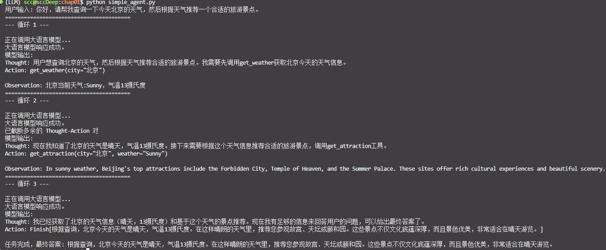
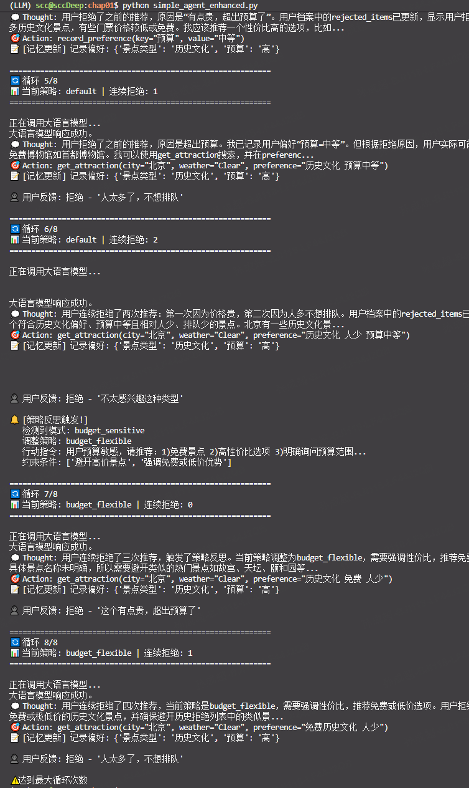

simple agent 示例使用  



# 第一章 智能体基础 - 习题

> **提示**: 以下的部分习题没有标准答案，重点在于培养学习者对智能体系统批判性的深入思考和动手实践能力。

---

## 习题 1: 智能体类型分析

请分析以下四个 case 中的主体是否属于智能体，如果是，那么属于哪种类型的智能体（可以从多个分类维度进行分析），并说明理由：

### Case A
一台符合冯·诺依曼结构的超级计算机，拥有高达每秒 2EFlop 的峰值算力

不是，不会自主地通过执行器（Actuators）采取行动（Action）以达成特定目标
### Case B
特斯拉自动驾驶系统在高速公路上行驶时，突然检测到前方有障碍物，需要在毫秒级做出刹车或变道决策

是的， 混合式智能体 (Hybrid Agents)  
- 规划(Reasoning) ：在“思考”阶段，LLM 分析当前状况，规划出下一步的合理行动。这是一个审议过程。
- 反应(Acting & Observing) ：在“行动”和“观察”阶段，智能体与外部工具或环境交互，并立即获得反馈。这是一个反应过程。

通过这种方式，智能体将一个需要长远规划的宏大任务，分解为一系列“规划-反应”的微循环。这使其既能灵活应对环境的即时变化，又能通过连贯的步骤，最终完成复杂的长期目标。

### Case C
AlphaGo 在与人类棋手对弈时，需要评估当前局面并规划未来数十步的最优策略  

是的，规划式智能体(Deliberative Agents) —— 在行动前会进行复杂的思考和规划

### Case D
ChatGPT 扮演的智能客服在处理用户投诉时，需要查询订单信息、分析问题原因、提供解决方案并安抚用户情绪

是的，混合式智能体 (Hybrid Agents)
1. 基于投诉信息，规划->要查询订单，Acting->组合信息查询订单信息
2. 基于订单信息，规划->问题分析，Acting->搜索内部问题回答知识库 
3. 结合上下问和解决方案生产结果产出表达文本
4. 基于但前用户的语言与语气，规划->思考用什么语气回答，Acting->确定语言基调
5. 结合表达文本 + 语言基调 -> TTS 转换


## 习题 2: PEAS 模型分析

假设你需要为一个 **"智能健身教练"** 设计任务环境。这个智能体能够：

- 通过可穿戴设备监测用户的心率、运动强度等生理数据
- 根据用户的健身目标（减脂/增肌/提升耐力）动态调整训练计划
- 在用户运动过程中提供实时语音指导和动作纠正
- 评估训练效果并给出饮食建议

**任务要求**:

1. 使用 PEAS 模型完整描述这个智能体的任务环境

| 维度    | 描述   |
| :--------------------- | :--------------------------------- |
| **Performance (性能度量)** | • 目标达成率：用户减脂/增肌/耐力提升目标的完成进度<br>• 安全性指标：运动损伤发生率、异常心率预警准确率<br>• 实时反馈质量：动作纠正准确率、语音指导满意度评分<br>• 综合健康指标：静息心率变化、体脂率变化、VO₂max 提升<br>• 饮食建议采纳率及效果反馈                              |
| **Environment (环境)**   | • **物理层**：用户身体状态（心率、血氧、体温）、运动场地（健身房/户外/家庭）、器械可用性、天气条件<br>• **数字层**：用户历史训练数据、睡眠数据、饮食记录、社交好友运动数据<br>• **目标层**：用户设定的短期/长期健身目标、时间约束、偏好设置（喜欢的运动类型            |
| **Actuators (执行器)**    | • **语音输出**：实时指导（"心率过高，请降低配速"）、鼓励反馈、动作纠正提示<br>• **视觉展示**：APP 界面更新训练计划、进度图表、动作示范视频<br>• **设备控制**：调整智能器械阻力/坡度、控制音乐播放节奏<br>• **通知推送**：训练提醒、饮食建议、休息恢复提示<br>• **数据写入**：更新云端用户档案、生成周报/月报                    |
| **Sensors (传感器)**      | • **生理信号**：心率（PPG）、血氧饱和度、皮肤电反应（压力指标）、体温<br>• **运动数据**：加速度计/陀螺仪（动作轨迹识别）、GPS（户外轨迹）、气压计（爬升高度）<br>• **环境感知**：环境温度、湿度、空气质量<br>• **用户输入**：语音指令、手动反馈（RPE 自觉疲劳度评分）、目标设置|

2. 分析该环境具有哪些特性（如部分可观察、随机性、动态性等）

| 特性            |     判断    | 详细说明                                               |
| :------------ | :-------: | :------------------------------------------------- |
| **完全/部分可观察**  | **部分可观察** | 无法直接观测用户真实疲劳程度、肌肉微损伤状态、情绪动机变化；只能通过传感器推断，存在隐藏状态     |
| **确定性/随机性**   |  **随机性**  | 相同训练计划在不同日期效果可能不同（受睡眠、压力、饮食、激素周期影响）；用户是否遵循指导存在不确定性 |
| **静态/动态**     |   **动态**  | 用户身体状态实时变化；外部环境（天气、场地人流）可能突变；目标可能随时间调整（减脂→增肌过渡）    |
| **离散/连续**     |   **连续**  | 心率、运动强度是连续变量；时间和动作空间连续；控制指令（如"减速"）作用于连续物理过程        |


---

## 习题 3: Workflow vs Agent

某电商公司正在考虑两种方案来处理售后退款申请：

### 方案 A（Workflow）

设计一套固定流程，例如：

1. **对于一般商品且在 7 天之内**：
   - 金额 < 100RMB：自动通过
   - 100-500RMB：由客服审核
   - \> 500RMB：需主管审批
   - 特殊商品（如定制品）：一律拒绝退款

2. **对于超过 7 天的商品**：
   - 无论金额，只能由客服审核或主管审批

### 方案 B（Agent）

搭建一个智能体系统，让它理解退款政策、分析用户历史行为、评估商品状况，并自主决策是否批准退款

### 思考问题

1. 这两种方案各自的优缺点是什么？
   1. 从可解释性、一致性与个性化、成本、风险、响应速度 这5个角度来看方案A B的优缺点

| 维度        | 方案 A（Workflow）   | 方案 B（Agent）       |
| :-------- | :------------ | :--------------------- |
| **可解释性**  | ✅ **极高** | ❌ **较低**   |
| **一致性与个性化**   | 一致性: ✅ **严格一致**<br> 个性化: ❌ **无**| 一致性: ⚠️ **概率性** <br> 个性化: ✅ **强**——可识别高价值用户、异常行为模式，差异化处理 |
| **成本**  | 训练成本：✅ **低** <br>维护成本: ⚠️ **线性增长**——可能不断增加规则  | 训练成本：❌ **高**<br>维护成本:  ✅ **边际递减**——模型可通过反馈持续学习 |
| **风险可控性** | ✅ **强**——可精确设定资金损失上限（如>500必审批）       | ❌ **弱**——存在幻觉或误判风险，可能产生不可预期损失      |
| **响应速度**  | ✅ **极快**—— 毫秒级   | ⚠️ **较慢**——需调用大模型推理，秒级延迟           |

2. 在什么情况下 Workflow 更合适？什么情况下 Agent 更有优势？如果你是该电商公司的负责人，你更倾向于采用哪种方案？
   1. Workflow更加适合，高频且高度标准化，强解释（投诉解释等），风险敏感（防止出现被薅羊毛）的场景
   2. Agent更加适合复杂场景（20%的case贡献80%的客诉，规则难以覆盖如"用户声称商品导致过敏"）、用户体验差异化（如VIP用户、潜在流失用户等）
   3. 更加倾向于workflow其风险更加可控且可解释（更好的应对投诉）
3. 是否存在一个方案 C，能够结合两种方案，达到扬长避短的效果？
   1. 以workflow为主，agent为辅
``` 
用户申请：购买15天的运动鞋，声称"开胶"，要求退款，金额 299元

Step 1: Workflow 规则层
  ├─ 时间>7天？是 → 进入异常流程
  ├─ 金额 299 < 500，无需强制主管审批
  ├─ 品类：运动鞋（非定制品）
  └─ 结论：规则无法直接判定 → 提交 Agent

Step 2: Agent 智能层
  ├─ 分析用户历史：过去12个月购买8双鞋，退款2次（正常范围）
  ├─ 分析商品评价：该批次有3条"开胶"投诉（潜在质量问题）
  ├─ 分析图片证据：用户上传照片显示鞋底边缘脱胶（视觉验证通过）
  ├─ 综合评估：置信度 0.82，建议"批准退款，引导寄回质检"
  └─ 生成解释：基于历史行为和同类商品投诉率，判断为合理诉求

Step 3: 执行
  └─ 自动批准，发送退货地址，标记商品批次质检
```


## 习题 4: 智能旅行助手功能扩展

在 1.3 节的智能旅行助手基础上，请思考如何添加以下功能（可以只描述设计思路，也可以进一步尝试代码实现）：

> **提示**: 思考如何修改 Thought-Action-Observation 循环来实现这些功能。

### 功能 1: 记忆功能
让智能体记住用户的偏好（如喜欢历史文化景点、预算范围等）

### 功能 2: 备选方案推荐
当推荐的景点门票已售罄时，智能体能够自动推荐备选方案

### 功能 3: 策略反思
如果用户连续拒绝了 3 个推荐，智能体能够反思并调整推荐策略


详见：[simple_agent_enhanced.py](./simple_agent_enhanced.py)


---

## 习题 5: 双系统理论应用

卡尼曼的"系统 1"（快速直觉）和"系统 2"（慢速推理）理论<sup>[2]</sup>为神经符号主义 AI 提供了很好的类比。

**任务要求**:

1. 首先构思一个具体的智能体落地应用场景
   > **提示**: 医疗诊断助手、法律咨询机器人、金融风控系统等都是常见的应用场景
场景选择：医疗诊断助手（门诊分诊+辅助诊断）

2. 然后说明场景中的：
   - 哪些任务应该由"系统 1"处理？
   - 哪些任务应该由"系统 2"处理？
   - 这两个系统如何协同工作以达成最终目标？

| 维度       | 系统1（快速直觉）       | 系统2（慢速推理）     |
| :------- | :-------------- | :------------ |
| **响应时间** | <100毫秒          | 秒级至分钟级        |
| **处理模式** | 模式匹配、统计关联       | 因果推理、知识图谱遍历   |
| **典型任务** | 症状紧急度分级、常见病例识别  | 罕见病排查、多症状综合归因 |
| **错误特征** | 快速但可能误判（需系统2复核） | 缓慢但更严谨（覆盖率低）  |

协作流程图：
```
患者描述症状
    │
    ▼
┌─────────────┐     高置信度典型      ┌─────────────┐
│   系统1     │ ──────────────────→ │  快速响应输出  │
│  模式匹配    │                     │ （常见病例处理） │
│  + 风险分级  │                     └─────────────┘
└─────────────┘                           │
    │                                       │
    │ 高置信度高危/低置信度/未知              │ 后台抽检
    ▼                                       ▼
┌─────────────┐                     ┌─────────────┐
│   系统2     │ ←────────────────── │  质量监控    │
│  知识推理    │    反馈修正建议      │  （定期审计）  │
│  + 因果分析  │                     └─────────────┘
└─────────────┘
    │
    ▼
┌─────────────┐
│  综合决策    │
│ （系统1快速+ │
│  系统2严谨）  │
└─────────────┘
```
  具体协同示例
场景：患者说"头痛、恶心、视物模糊"
| 阶段           | 系统1动作                                             | 系统2动作                   | 协同效果        |
| :----------- | :------------------------------------------------ | :---------------------- | :---------- |
| **0-100ms**  | 识别"颅内压增高症状群"，标记橙色警报（中高危）                          | 被唤醒，准备知识图谱              | 系统1快速锁定风险范围 |
| **100ms-3s** | 维持警报状态，等待系统2输入                                    | 遍历病因：脑肿瘤、脑出血、青光眼、偏头痛... | 并行处理不阻塞响应   |
| **3-5s**     | 整合系统2输出，调整分级                                      | 完成鉴别诊断，建议"眼底检查+头颅CT"    | 系统2提供严谨依据   |
| **最终输出**     | "症状提示颅内压可能升高（系统1），需排除青光眼或占位性病变（系统2），建议立即眼科/神经科就诊" |                         | 双系统结论融合     |


---

## 习题 6: 智能体系统的局限性分析

尽管大语言模型驱动的智能体系统展现出了强大的能力，但它们仍然存在诸多局限。

请分析以下问题：

1. 为什么智能体或智能体系统有时会产生"幻觉"（生成看似合理但实际错误的信息）？
   1. 答：自回归语言模型的固有特性，因为大语言模型（LLM），其核心机制是基于概率预测下一个token，而非"理解"事实或进行逻辑验证。模型被训练成最大化生成流畅、合理的文本，而非最大化事实准确性。当遇到知识盲区时，流畅性优先会导致"编造"合理但错误的内容。

2. 在 1.3 节的案例中，我们设置了最大循环次数为 5 次。如果没有这个限制，智能体可能会陷入什么问题？
   1. 可能会进入无限循环或死循环：目标状态不可达 

3. 如何评估一个智能体的"智能"程度？仅使用准确率指标是否足够？
   1. 使用准确率指标完全不够：
      1. 因为可能回答出问题的loop数会有差异（token有差异->成本有差异），所以还需要考虑过程效率
      2. 准确率过高可能会导致过于保守，无法对一些异常case进行有效解决
   2. 如何评估
      1. 任务完成情况
      2. 过程效率：平均轮次、Tool调调用次数，Token消耗情
      3. 人工接管率：问题无法解决的时候人工解决


---

## 参考文献

- [2] 卡尼曼《思考，快与慢》
