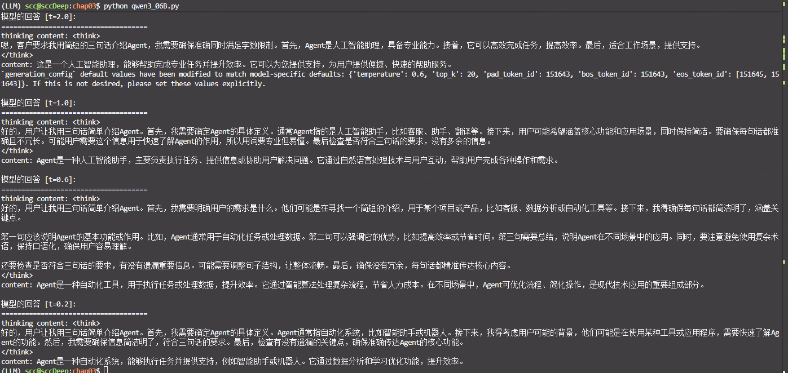
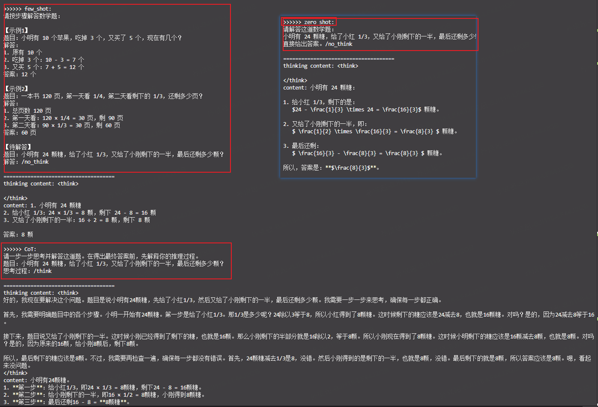

# 第三章习题

## 一、语言模型基础

### 习题 1
自然语言处理中，语言模型经历了从统计到神经网络的模型演进。

请使用本章提供的迷你语料库（`datawhale agent learns`, `datawhale agent works`），计算句子 `agent works` 在 **Bigram 模型**下的概率。

只与上一个词有关
$$\text{Bigram}: P(w_i|w_1, ..., w_{i-1})  \approx P(w_i|w_{i-1}) = \frac{Count(w_{i-1}, w_i)}{Count(w_{i-1})}$$


**情况一：agent为句子的起始**
直接计算会计算出0 ，因为agent从来没有从开始出现  
$P(agent\ works)=P(agent|<start>)P(works|agent) = 0/2 \times \frac{1}{2}=0$

需要平滑处理（Add-1 Smoothing）  
$|V|=4, \{datawhale, agent, learns, works\}，$
$P_{add-1}(w_i|w_{i-1})=\frac{Count(w_{i-1}, w_i)+1}{Count(w_{i-1}) + |V|}$

$P_{add-1}(agent\ works)=\frac{0+1}{2+4} \times \frac{1+1}{2+4}=1/18$

**情况二：从语料库中随机选起点，生成"agent works"片段的概率**

$P(agent\ works)=P(agent)P(works|agent) = 2/6 \times 1/2=1/6$


### 习题 2
N-gram 模型的核心假设是**马尔可夫假设**。请解释这个假设的含义，以及 N-gram 模型存在哪些根本性局限？

- N-gram 模型的马尔可夫假设：一个词的出现概率仅依赖于它前面的 N-1 个词，与更早的历史无关。

从这个假设中就能看出2个问题：
1. 长距离依赖丢失
2. 连贯性缺失：生成越长主题就会逐渐丢失


### 习题 3
神经网络语言模型（RNN/LSTM）和 Transformer 分别是如何克服 N-gram 模型局限的？它们各自的优势是什么？

从"统计局部共现"（N-gram）到"压缩历史信息"（RNN）再到"直接全局关联"（Transformer），语言模型逐步逼近人类对上下文的灵活利用方式。

| 维度        | N-gram  | RNN/LSTM   | Transformer   |
| --------- | ------- | ---------- | ------------- |
| **使用场景** | 资源极度受限、需要严格可解释性、短文本快速匹配  | 中等长度序列、实时流式处理（低延迟）、轻量级部署 | 长文档理解、需要全局语境的生成任务、预训练-微调范式       |
| **上下文范围** | 固定 N-1  | 理论上无限，实际有限 | **全局**        |
| **长距离依赖** | ❌ 无     | ⚠️ 有但弱     | ✅ **强**       |
| **并行性**   | ✅ 高     | ❌ 顺序计算     | ✅ **高**       |
| **训练稳定性** | ✅ 稳定    | ⚠️ 梯度问题    | ⚠️ 需精心设计      |
| **计算复杂度** | O(1) 查表 | O(n) 序列长度  | O(n²) 注意力矩阵   |
| **语义理解**  | ❌ 无     | ✅ 嵌入空间     | ✅ **深层上下文表示** |
| **可解释性**  | ✅ 高     | ⚠️ 中       | ⚠️ 注意力权重部分可解释 |

 
---

## 二、Transformer 架构

Transformer 架构是现代大语言模型的基础。

### 习题 4

> 💡 **提示**：可以结合本章 3.1.2 节的代码实现来辅助理解

1. **自注意力机制（Self-Attention）**的核心思想是什么？  
   - 每个词都能直接看到所有其他词，并根据相关性动态决定关注哪些

2. 为什么 Transformer 能够**并行处理序列**，而 RNN 必须**串行处理**？**位置编码（Positional Encoding）**在其中起什么作用？
   - Transformer自注意力计算中，所有位置的 Q/K/V 矩阵可以独立生成，没有序列依赖；RNN $h_t$的计算依赖$h_{t-1}$
   - 位置编码注入绝对/相对位置信息：将位置信息编码为与词嵌入同维度的向量，直接相加到输入嵌入中

3. **Decoder-Only 架构**与完整的 **Encoder-Decoder 架构**有什么区别？为什么现在主流的大语言模型都采用 Decoder-Only 架构？
   - 架构差异如下  

| 组件          | Encoder-Decoder (BERT/T5) | Decoder-Only (GPT) |
| ----------- | ------------------------- | ------------------ |
| **Encoder** | 双向注意力，理解输入                | ❌ 无                |
| **Decoder** | 自回归生成输出                   | ✅ 唯一组件             |
| **注意力掩码**   | Encoder双向，Decoder因果       | 统一因果掩码             |
| **典型应用**    | 翻译、摘要、填空                  | 文本生成、对话            |
   - 都采用Decoder-Only 的原因:因果语言建模让每个 token 都成为训练目标，数据效率和计算效率更高
     - 训练效率：100% token 利用率 vs 稀疏掩码
     - 扩展定律验证：相同参数规模下，Decoder-Only 的 scaling 曲线更优
     - 涌现能力：`In-context learning`、`Chain-of-thought` 等能力在 Decoder-Only 中更显著
     - 工程简化：单一架构降低系统复杂度，利于超大规模训练
 
| 维度/对比项      | Decoder-Only (GPT)                    | Encoder-Decoder (T5)               |
| ----------- | ------------------------------------- | ---------------------------------- |
| **预训练目标**   | 因果语言建模（CLM）<br>`P(w_t \| w_{<t})`     | 去噪自编码（Span Corruption）<br>预测被掩码的片段 |
| **有效上下文利用** | 100% token 都参与预测                      | 仅掩码部分（通常15%）参与预测                   |
| **训练信号密度**  | **每个位置都产生梯度**                         | 仅掩码位置产生梯度                          |
| **计算效率**    | **同等 FLOPs 下更多更新**                    | 部分计算用于编码未掩码内容                      |
| **扩展到千亿参数** | 路径清晰（GPT-3, PaLM, LLaMA）              | 较少尝试（T5-11B 后主流转向 Decoder）         |
| **统一性**     | 单一模块，预训练=微调=推理                        | 编码器预训练与解码器生成存在 gap                 |
| **涌现行为**    | 足够规模后展现上下文学习、指令跟随                     | 同样规模下涌现能力较弱（推测）                    |
| **工程生态**    | 推理优化（KV-Cache、speculative decoding）成熟 | 针对 Encoder-Decoder 的优化较少           |
| **历史路径依赖**  | GPT-3 成功 → 资源投入 → 生态正循环               | —                                  |

### 习题 5
文本子词分词算法是大语言模型的一项关键技术，负责将文本转换为模型可处理的 token 序列。

1. 为什么不能直接以 **"字符"** 或 **"单词"** 作为模型的输入单元？
    - 在word2vec后几年确实有用"字符"做输入单元是有paper的 [EMNLP2015] Finding Functoin in Form:Compositional Open Vocabulary Word Representation
      - 但是他有个基本假设 - 词与词之间独立的假设，没有词的组合语义弱，预训练需要大量局部组合
    - "单词"显然就是经典的OOV, 和词汇表爆炸
2. **BPE（Byte Pair Encoding）** 算法解决了什么问题？

核心思想： 用频率最高的字符对逐步合并，动态构建词汇表
| 问题          | BPE 解决方案                          |
| ----------- | --------------------------------- |
| **词汇表大小可控** | 从字符开始，迭代合并至预设规模（如32k-100k）        |
| **OOV 问题**  | 任何词都可拆分为已知子词，无未登录词                |
| **形态变化关联**  | "run" + "ning" → "running"，共享词根表示 |
| **跨语言兼容**   | 字节级 BPE 可处理多语言、表情符号、代码            |


---

## 三、本地部署与实践

本章 3.2.3 节介绍了如何本地部署开源大语言模型。

### 习题 6

> 💡 **提示**：这是一道动手实践题，建议实际操作

1. 按照本章的指导，在本地部署一个轻量级的开源模型（推荐 **Qwen3-0.6B**），并尝试调整采样参数并观察其对输出的影响  

[qwen3_06B.py](./qwen3_06B.py)  


2. 选择一个具体任务（如文本分类、信息抽取、代码生成等），设计并对比以下不同的提示策略（如 **Zero-shot**、**Few-shot**、**Chain-of-Thought**）对输出结果的效果差异

```python
generated_ids = model.generate(
    **model_inputs,
    max_new_tokens=32768,
    generation_config=GenerationConfig(
        temperature=0.6,
        top_p=0.9,
        do_sample=True
    )
)
```



3. 从**性能**、**成本**、**可控性**、**隐私**等维度比较闭源模型和开源模型

闭源模型当前仍是"性能即服务"的便捷选择，但开源模型在成本、可控、隐私三维度形成不可替代优势，长期看混合架构（闭源通用 + 开源垂直）将成为主流。

| 维度       | 闭源模型 (GPT-4, Claude, Gemini) | 开源模型 (LLaMA, Qwen, DeepSeek) |
| -------- | ---------------------------- | ---------------------------- |
| **性能**   | 顶级能力，SOTA 表现                 | 追赶中，部分场景接近闭源                 |
| **成本**   | API 按量付费，长期累积高               | 一次性部署/训练成本，边际成本低             |
| **可控性**  | 黑盒，受厂商政策限制                   | 白盒，可修改架构、微调、蒸馏               |
| **隐私**   | 数据上传至第三方                     | 本地部署，数据不出域                   |
| **定制化**  | 有限（提示工程、RAG）                 | 深度（继续预训练、领域适配）               |
| **生态依赖** | 强绑定厂商服务                      | 自主可控，社区驱动                    |
| **透明度**  | 低（训练数据、架构未知）                 | 高（可审计、可复现）                   |


4. 如果你要构建一个企业级的客服智能体，你会选择哪种类型的模型？需要考虑哪些因素？

选择开源70B级模型作为主力（Qwen2.5/DeepSeek/LLaMA3），闭源API作为复杂场景兜底，轻量模型负责路由和意图分类。  
核心考量：  
1)隐私合规不可妥协 → 必须本地部署  
2)成本结构决定商业模式 → 开源边际成本优势  
3)客服场景80/20分布 → 简单查询用开源，复杂用闭源  
4)可控性 > 绝对性能 → 可解释、可审计、可回滚  

```
┌─────────────────────────────────────────┐
│           企业级客服智能体架构            │
├─────────────────────────────────────────┤
│  核心引擎：开源模型（70B级，本地部署）    │
│  ├── 高频查询处理（80%流量）              │
│  ├── 敏感数据交互（订单、账户信息）        │
│  └── 标准SOP执行（退款、改地址等）         │
├─────────────────────────────────────────┤
│  增强模块：闭源API（按需调用）            │
│  ├── 复杂推理兜底（争议处理、情感安抚）     │
│  ├── 多模态理解（图片、语音投诉）          │
│  └── 实时知识更新（新产品、活动政策）        │
├─────────────────────────────────────────┤
│  路由层：意图分类器（轻量模型）            │
│  └── 自动分流至开源/闭源/人工              │
└─────────────────────────────────────────┘
```

| 因素       | 具体要求              | 模型选择          |
| -------- | ----------------- | ------------- |
| **数据隐私** | 用户订单、支付信息不可出域     | **开源本地部署**为主  |
| **响应延迟** | <500ms，高并发（万级QPS） | 开源 + vLLM推理优化 |
| **成本控制** | 客服中心毛利薄，需极致降本     | 开源边际成本趋近于零    |
| **定制化**  | 垂直领域知识、企业SOP      | 开源可深度微调       |
| **复杂推理** | 极端客诉、跨部门协调        | 闭源API兜底       |
| **合规审计** | 输出可追溯、可解释         | 开源白盒可控        |


---

## 四、模型幻觉与缓解方法

**模型幻觉（Hallucination)** 是大语言模型当前存在的关键局限性之一。本章介绍了缓解幻觉的方法（如检索增强生成、多步推理、外部工具调用）。

### 习题 7
1. 请选择其中一种方法，说明其**工作原理**和**适用场景**

检索增强生成（RAG）  
**工作原理:**
```
标准生成：P(y|x) —— 仅依赖模型参数中的"记忆"
                    ↓ 容易幻觉（编造事实）

RAG生成：P(y|x) = Σ P(z|x) · P(y|x,z) —— 外部知识验证
                    ↓
┌─────────┐    ┌─────────┐    ┌─────────┐
│ 查询x   │ → │ 检索器  │ → │ 相关文档z │
│         │    │(向量DB) │    │(可信来源) │
└─────────┘    └─────────┘    └────┬────┘
                                    ↓
                              ┌─────────┐
                              │ 生成器  │ → 基于(x,z)生成y
                              │(LLM)   │    有依据，可溯源
                              └─────────┘
```
**适用场景：**

| 场景        | 为什么RAG有效    | 示例             |
| --------- | ----------- | -------------- |
| **事实性问答** | 需要实时、精确的知识  | 产品规格、政策条款、医学指南 |
| **动态信息**  | 模型训练后发生的变化  | 股价、天气、新闻事件 （用MCP也行）   |
| **专业领域**  | 模型预训练数据覆盖不足 | 企业内部知识、垂直行业标准  |
| **可审计需求** | 输出必须可追溯验证   | 法律、金融、医疗决策支持   |


2. 调研前沿的研究和论文，是否还有其他的缓解模型幻觉的方法，他们又有哪些改进和优势？

| 方法                        | 核心思想      | 代表论文                    | 优势          |
| ------------------------- | --------- | ----------------------- | ----------- |
| **RAG**                   | 外部检索验证    | Lewis et al., 2020      | 即插即用，可实时更新  |
| **Self-RAG**              | 生成中自反思检索  | Asai et al., 2023       | 按需检索，减少噪声   |
| **FactScore**             | 原子级事实验证   | Min et al., 2023        | 细粒度评估，可定位错误 |
| **Chain-of-Verification** | 多步自我验证    | Dhuliawala et al., 2023 | 不依赖外部工具     |
| **Toolformer/Gorilla**    | 学习调用API验证 | Schick et al., 2023     | 精确计算/实时查询   |
| **RARR**                  | 编辑后追溯重写   | Gao et al., 2023        | 保持流畅性同时修正   |
| **LM vs LM**              | 模型互审      | Cohen et al., 2023      | 无需人工标注      |

**重点介绍：Self-RAG（2023）**  
改进点：传统RAG"先检索再生成"，Self-RAG"生成中动态决定是否需要检索"  

```
传统RAG：检索 → 拼接文档 → 生成（一次性）
            ↓ 问题：检索噪声、无关文档干扰

Self-RAG：生成token → [反思] → 需要检索？→ 是 → 检索 → 继续生成
                              ↓ 否
                         直接生成
```

**关键创新：** 
1)反思Token（Reflection Tokens）：模型自学习判断"是否需要检索"   
2)检索控制：避免过度检索（节省成本）和检索不足（幻觉风险）  
3)优势：比标准RAG减少30%幻觉，同时降低50%检索调用。  


### 习题 8
假设你要设计一个**论文辅助阅读智能体**，它能够帮助研究人员快速阅读并理解学术论文，包括：
- 总结论文研究的核心内容
- 回答关于论文的问题
- 提取关键信息
- 比较多篇不同论文的观点等

请回答：

1. 你会选择哪个模型作为智能体设计时的**基座模型**？选择时需要考虑哪些因素？
推荐选择：Claude 3.5 Sonnet / Claude 3 Opus 或 GPT-4 系列

| 考量维度       | 具体因素                              | 权重    |
| ---------- | --------------------------------- | ----- |
| **长上下文能力** | 论文常达10k-100k tokens，需支持200k+上下文窗口 | ⭐⭐⭐⭐⭐ |
| **推理与逻辑**  | 理解复杂论证结构、因果关系、方法论评估               | ⭐⭐⭐⭐⭐ |
| **领域泛化**   | 跨CS、医学、物理、社科等多学科表现稳定              | ⭐⭐⭐⭐  |
| **事实准确性**  | 减少幻觉，对专业术语理解准确                    | ⭐⭐⭐⭐⭐ |
| **指令遵循**   | 能严格遵守"基于原文回答"的约束                  | ⭐⭐⭐⭐  |
| **成本效率**   | 长文本推理成本可控，支持批量处理                  | ⭐⭐⭐   |

2. 如何设计**提示词**来引导模型更好地理解学术论文？学术论文通常很长，可能超过模型的**上下文窗口**限制，你会如何解决这个问题？

提示词
```
# 角色定义
你是专业的学术研究助手，擅长计算机科学/医学/物理学（根据论文动态调整）领域的论文解析。
你的任务是帮助研究者高效理解论文，所有回答必须严格基于提供的论文内容。

# 核心约束（必须遵守）
1. 【忠实原则】所有信息必须能在原文中找到对应，禁止推测或引入外部知识
2. 【溯源原则】回答时标注信息来源（章节/段落/图表编号）
3. 【不确定原则】若原文信息不足，明确说明"原文未提及"而非编造

# 任务指令
用户请求：{task_type}  // 总结/问答/对比/提取

论文内容：
---
{paper_content}
---

# 输出格式要求
- 结构化呈现（使用Markdown）
- 关键术语首次出现时标注英文原文
- 涉及数据时保留原文精确值
```

**上下文窗口**限制处理
| 策略                                   | 实现方式                        | 适用场景    |
| ------------------------------------ | --------------------------- | ------- |
| **分块检索（Chunking + RAG）**             | 按章节/段落切分，构建向量索引，按需检索相关片段    | 问答、信息提取 |
| **分层摘要（Hierarchical Summarization）** | 先分段摘要，再递归合并成全局摘要            | 论文总结    |
| **滑动窗口+关键段定位**                       | 识别摘要、结论、方法等关键章节优先处理         | 快速概览    |
| **多智能体协作**                           | 不同Agent分别处理：背景/方法/实验/结论，再整合 | 深度分析    |


3. 学术研究是严谨的，这意味着我们需要确保智能体生成的信息是**准确、客观、忠于原文**的。你认为系统中加入哪些设计能够更好地实现这一需求？

系统架构设计
```
┌─────────────────────────────────────────────────────────┐
│                    用户交互层                            │
│              （提问/上传论文/选择任务类型）                │
└─────────────────────────────────────────────────────────┘
                           ↓
┌─────────────────────────────────────────────────────────┐
│                   预处理与解析层                          │
│  • PDF解析 → 结构化文本（保留章节、图表、参考文献结构）     │
│  • 元数据提取（标题、作者、期刊、年份）                    │
│  • 关键段落标记（摘要、方法、结论）                        │
└─────────────────────────────────────────────────────────┘
                           ↓
┌─────────────────────────────────────────────────────────┐
│                   核心处理引擎                            │
│  ┌─────────────┐  ┌─────────────┐  ┌─────────────────┐ │
│  │  检索模块    │  │  推理模块    │  │   验证模块       │ │
│  │ (RAG/关键词) │  │ (LLM+Prompt)│  │ (一致性检查)     │ │
│  └─────────────┘  └─────────────┘  └─────────────────┘ │
└─────────────────────────────────────────────────────────┘
                           ↓
┌─────────────────────────────────────────────────────────┐
│                   后处理与验证层                          │
│  • 引用溯源检查（回答中的事实是否能在原文定位）              │
│  • 不确定性标注（置信度评分）                              │
│  • 人工复核标记（高风险结论高亮）                          │
└─────────────────────────────────────────────────────────┘
```
关键机制设计

| 机制                           | 实现方式                               | 作用     |
| ---------------------------- | ---------------------------------- | ------ |
| **引用锚定（Citation Anchoring）** | 强制模型输出`[Section X, Para Y]`格式的引用标记 | 确保可验证性 |
| **自洽性检查（Self-Consistency）**  | 同一问题多次采样，检查答案一致性                   | 检测模型幻觉 |
| **原文比对（Grounding Check）**    | 用文本相似度模型验证回答与原文片段的关联度              | 防止离题发挥 |
| **置信度分级**                    | 高/中/低三档，低置信度内容强制标注"推测"             | 风险透明化  |
| **人工介入触发**                   | 当涉及核心结论解释、数据解读时提示"建议人工复核"          | 关键决策保护 |


提示词约束
```
# 准确性保障规则
在回答前，请执行以下自检：
1. 【溯源检查】我提到的每个事实都能在提供的论文中找到吗？
2. 【边界检查】我是否区分了"论文声称"和"事实本身"？
3. 【量化检查】涉及数值时，是否与原文完全一致？
4. 【否定检查】我是否遗漏了原文中的关键限定词（如"可能"、"在特定条件下"）？

若以上任一检查不通过，调整回答或明确标注不确定性。
```