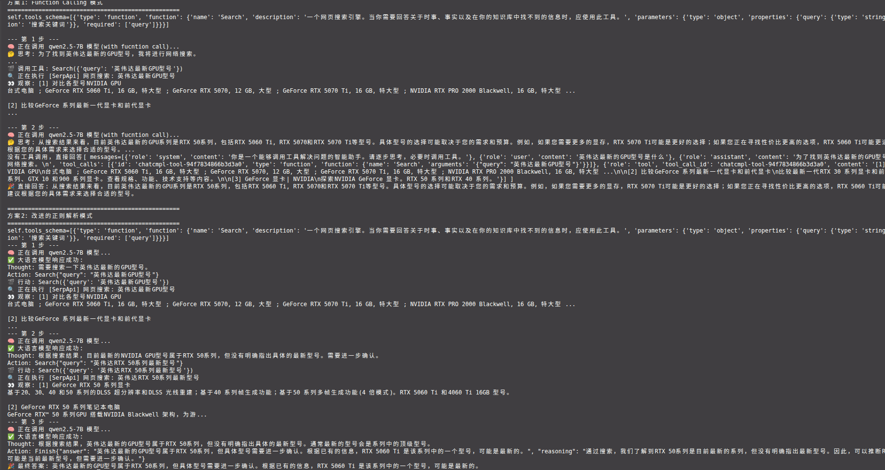

# 第四章习题：智能体范式设计与实践

> 💡 **提示**：部分习题没有标准答案，重点在于培养学习者对智能体范式设计的综合理解和实践能力。

---

## 目录

- [第四章习题：智能体范式设计与实践](#第四章习题智能体范式设计与实践)
  - [目录](#目录)
  - [习题 1：三种经典智能体范式对比分析](#习题-1三种经典智能体范式对比分析)
  - [习题 2：ReAct 输出解析的鲁棒性思考](#习题-2react-输出解析的鲁棒性思考)
  - [习题 3：工具调用扩展实践](#习题-3工具调用扩展实践)
  - [习题 4：Plan-and-Solve 深度分析](#习题-4plan-and-solve-深度分析)
  - [习题 5：Reflection 机制的思考](#习题-5reflection-机制的思考)
  - [习题 6：提示词工程分析](#习题-6提示词工程分析)
  - [习题 7：电商客服智能体设计](#习题-7电商客服智能体设计)

---

## 习题 1：三种经典智能体范式对比分析

本章介绍了三种经典的智能体范式：**ReAct**、**Plan-and-Solve** 和 **Reflection**。请分析以下问题：

1. 这三种范式在"思考"与"行动"的组织方式上有什么本质区别？
- **ReAct**边想边做-交错进行: 主要Thought → Action → Observation → Thought ，每步推理决定下一步行动，无预设计划，观察驱动
- **Plan-and-Solve**先思考后行动: 主要是先对用户问题进行思考拆解成n个步骤，行动上结合用户问题+plan+之前步骤的上下文一步步的执行，最终给出用户答案
- **Reflection**执行后反思再优化: 显式评估输出质量，发现错误后回溯修正，可嵌入前两种范式

2. 如果要设计一个**智能家居控制助手**（需要控制灯光、空调、窗帘等多个设备，并根据用户习惯自动调节），你会选择哪种范式作为基础架构？为什么？
- X 采用**Plan-and-Solve**先思考后行动: 用户可能会一次下达多个命令，所以需要先计划后行动. 多命令 ≠ 需要预设计划
- ReAct 完全可以处理多命令：识别意图 → 执行A → 观察结果 → 执行B → ...
- 且 ReAct 的优势是每步都能根据设备实际状态调整
  
| 评估维度   | Plan-and-Solve | ReAct      | ReAct+Reflection |
| ------ | -------------- | ---------- | ---------------- |
| 多命令处理  | ✅ 可以           | ✅ 更好（动态调整） | ✅ 更好             |
| 设备故障应对 | ❌ 无能力          | ✅ 每步观察     | ✅ 每步观察           |
| 用户习惯学习 | ❌ 无能力          | ❌ 无显式反思    | ✅ 评估+迭代          |
| 环境动态适应 | ❌ 静态计划         | ✅ 观察驱动     | ✅ 观察驱动           |

所以我们最后选择 ReAct + Reflection
```
# 示例流程（ReAct 核心）
用户: "我要睡了"
Thought: 用户需要睡眠环境，涉及灯光、窗帘、空调
Action: 调用灯光API → 调暗
Observation: 灯光已调至20%
Thought: 下一步关窗帘
Action: 调用窗帘API
Observation: 窗帘卡住，电机过热报警
Thought: 设备故障，跳过此步骤，记录日志，继续空调
Action: 调用空调API → 睡眠模式
Observation: 空调响应成功
Thought: 任务基本完成，窗帘故障需后续处理
Final Answer: 已为您调暗灯光、开启空调睡眠模式，窗帘设备异常已记录

# Reflection 附加（长期优化）
每日执行后: 评估用户是否手动调整过设置
若用户每晚都手动把空调从26°C调到24°C → 反思修正默认策略
```
整体的智能体框架
```
用户输入 → ReAct执行 → 【L1即时调整】 → 执行 → 观察 → 【L2任务反思】 → 响应用户
                                    ↓
                              【L3策略优化】(定时触发)
```
[python实现：smart_home_agent](./smart_home_agent/agent.py)


3. 是否可以将这三种范式进行组合使用？若可以，请尝试设计一个混合范式的智能体架构，并说明其适用场景。
> "Plan制定、ReAct执行、Reflection优化"只是三层名字的堆砌，真正的混合架构需要设计失败回退链路、触发条件、反馈闭环——否则只是"把三个文件放同一个文件夹"，不是"融合成一个系统"

三层有明确的失败回退机制
```
┌─────────────────────────────────────────┐
│  L1: Plan-and-Solve（正常路径）          │
│  稳定场景 → 预设计划 → 高效执行           │
│  成功条件：环境符合预期、设备正常         │
├─────────────────────────────────────────┤
│  ↓ 失败触发：设备异常/计划步骤失效         │
├─────────────────────────────────────────┤
│  L2: ReAct（应急路径）                   │
│  动态场景 → 边观察边决策 → 灵活调整       │
│  降级条件：L1任何步骤失败或超时           │
├─────────────────────────────────────────┤
│  ↓ 失败触发：连续3次Action无进展          │
├─────────────────────────────────────────┤
│  L3: Reflection（修复路径）              │
│  诊断L1/L2失败根因 → 生成改进规则         │
│  输出：更新习惯库/修正Plan模板            │
│  （异步，不阻塞当前任务）                 │
└─────────────────────────────────────────┘
```
关键设计：触发条件与反馈闭环

| 层级         | 触发条件         | 成功输出   | 失败回退      | 反馈到哪里                 |
| ---------- | ------------ | ------ | --------- | --------------------- |
| Plan       | 用户请求         | 执行完成   | → ReAct   | Reflection（规则库）       |
| ReAct      | Plan失败或不确定环境 | 执行完成   | → 人工/简化模式 | Reflection（失败案例）      |
| Reflection | 任务结束         | 新规则/策略 | （无，异步）    | Plan的模板库 + ReAct的短期记忆 |


---

## 习题 2：ReAct 输出解析的鲁棒性思考

在 4.2 节的 ReAct 实现中，我们使用了正则表达式来解析大语言模型的输出（如 `Thought` 和 `Action`）。请思考以下问题：

1. 当前的解析方法存在哪些潜在的脆弱性？在什么情况下可能会失败？
| 场景                         | 示例输出                                | 失败结果                          |
| -------------------------- | ----------------------------------- | ----------------------------- |
| **Action 含多行**             | `Action: Search[英伟达\nGPU\n型号]`      | `tool_input` 只捕获到第一行或格式错乱     |
| **Thought 含 "Action:" 字样** | `Thought: 我应该Action: carefully...`  | Thought 被截断，Action 解析为空       |
| **模型输出格式偏差**               | `Action：Search[...]`（中文冒号）          | 匹配失败  (`re.findall`可以)                   |
| **工具输入含 `]`**              | `Search[公式：E=mc²]`                  | `]` 提前闭合，内容截断                 |
| **多余空行/缩进**                | `Action:\n  Search[...]`            | 捕获到 `\n  Search[...]`，工具名解析失败 |
| **Finish 格式不标准**           | `Finish[答案是...]` 写成 `Finish：答案是...` | 无法识别终止条件，无限循环                 |

1. 除了正则表达式，还有哪些更鲁棒的输出解析方案？
- 很多模型本身后训练的时候就考虑到了，可以直接用function_call 方式获取action

1. 尝试修改本章的代码，使用一种更可靠的输出格式，并对比两种方案的优缺点。



---

## 习题 3：工具调用扩展实践

工具调用是现代智能体的核心能力之一。基于 4.2.2 节的 `ToolExecutor` 设计，请完成以下扩展实践：

> 📝 **提示**：这是一道动手实践题，建议实际编写代码。

1. 为 ReAct 智能体添加一个**计算器**工具，使其能够处理复杂的数学计算问题（如：`计算 (123 + 456) × 789 / 12 = ?` 的结果）。

2. 设计并实现一个**工具选择失败**的处理机制：当智能体多次调用错误的工具或提供错误的参数时，系统应该如何引导它纠正？

3. 思考：如果可调用工具的数量增加到 50 个甚至 100 个，当前的工具描述方式是否还能有效工作？在可调用工具数量随业务需求显著增加时，从工程角度如何优化工具的组织和检索机制？

---

## 习题 4：Plan-and-Solve 深度分析

Plan-and-Solve 范式将任务分解为"规划"和"执行"两个阶段。请深入分析以下问题：

1. 在 4.3 节的实现中，规划阶段生成的计划是"静态"的（一次性生成，不可修改）。如果在执行过程中发现某个步骤无法完成或结果不符合预期，应该如何设计一个**动态重规划**机制？

2. 对比 Plan-and-Solve 与 ReAct：在处理**预订一次从北京到上海的商务旅行（包括机票、酒店、租车）**这样的任务时，哪种范式更合适？为什么？

3. 尝试设计一个**分层规划**系统：先生成高层次的抽象计划，然后针对每个高层步骤再生成详细的子计划。这种设计有什么优势？

---

## 习题 5：Reflection 机制的思考

Reflection 机制通过"执行-反思-优化"循环来提升输出质量。请思考以下问题：

1. 在 4.4 节的代码生成案例中，不同阶段使用的是同一个模型。如果使用两个不同的模型（例如，用一个更强大的模型来做反思，用一个更快的模型来做执行），会带来什么影响？

2. Reflection 机制的终止条件是"反馈中包含无需改进"或"达到最大迭代次数"。这种设计是否合理？能否设计一个更智能的终止条件？

3. 假设你要搭建一个**学术论文写作助手**，它能够生成初稿并不断优化论文内容。请设计一个**多维度的 Reflection 机制**，从段落逻辑性、方法创新性、语言表达、引用规范等多个角度进行反思和改进。

---

## 习题 6：提示词工程分析

提示词工程是影响智能体最终效果的关键技术。本章展示了多个精心设计的提示词模板。请分析以下问题：

1. 对比 4.2.3 节的 ReAct 提示词和 4.3.2 节的 Plan-and-Solve 提示词，它们显然存在结构设计上的明显不同，这些差异是如何服务于各自范式的核心逻辑的？

2. 在 4.4.3 节的 Reflection 提示词中，我们使用了"你是一位极其严格的代码评审专家"这样的角色设定。尝试修改这个角色设定（如改为"你是一位注重代码可读性的开源项目维护者"），观察输出结果的变化，并总结角色设定对智能体行为的影响。

3. 在提示词中加入 few-shot 示例往往能显著提升模型对特定格式的遵循能力。请为本章的某个智能体尝试添加 few-shot 示例，并对比其效果。

---

## 习题 7：电商客服智能体设计

某电商初创公司现在希望使用**客服智能体**来代替真人客服实现降本增效，它需要具备以下功能：

- **a.** 理解用户的退款申请理由
- **b.** 查询用户的订单信息和物流状态
- **c.** 根据公司政策智能地判断是否应该批准退款
- **d.** 生成一封得体的回复邮件并发送至用户邮箱
- **e.** 如果判断决策存在一定争议（自我置信度低于阈值），能够进行自我反思并给出更审慎的建议

此时作为该产品的负责人，请回答以下问题：

1. 你会选择本章的哪种范式（或哪些范式的组合）作为系统的核心架构？

2. 这个系统需要哪些工具？请列出至少 3 个工具及其功能描述。

3. 如何设计提示词来确保智能体的决策既符合公司利益，又能保持对用户的友好态度？

4. 这个产品上线后可能面临哪些风险和挑战？如何通过技术手段来降低这些风险？

---

> 💡 **学习建议**：建议先独立完成这些习题，再参考课程资料或与他人讨论。实践过程中遇到的问题往往是最有价值的学习机会。
