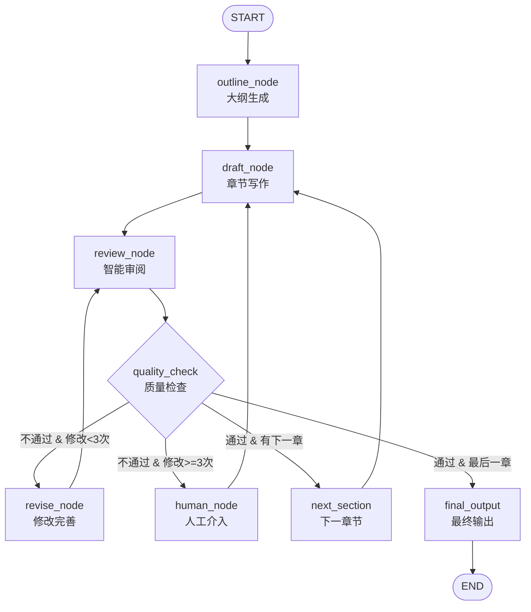
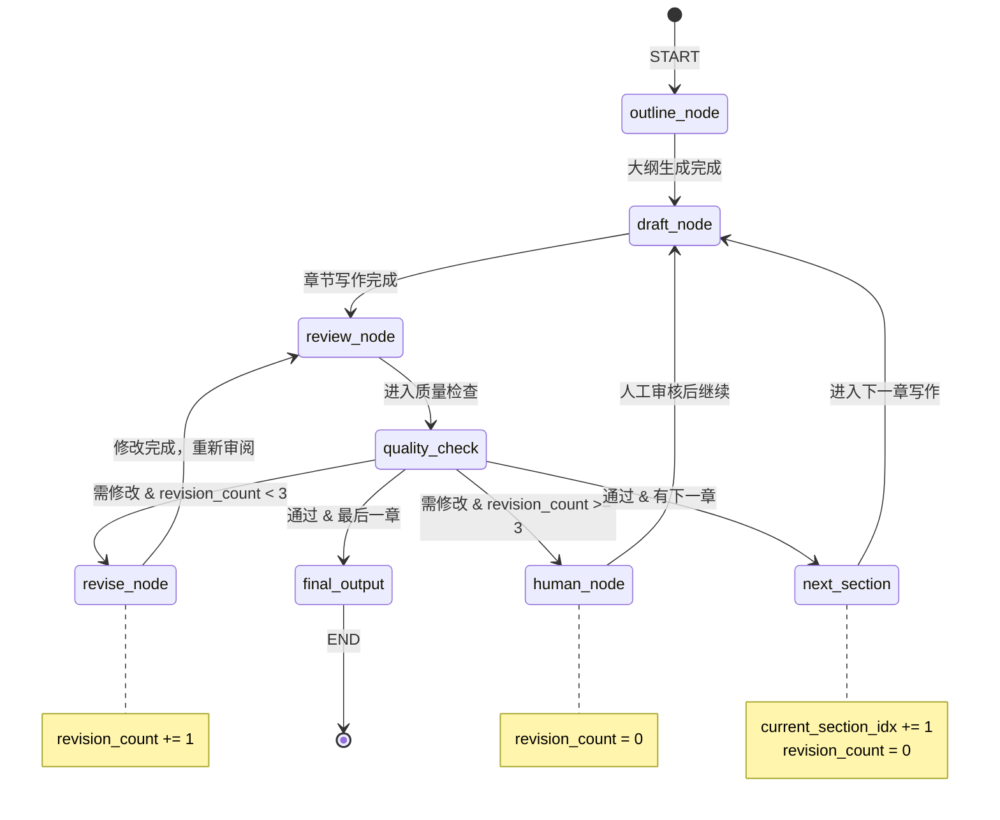
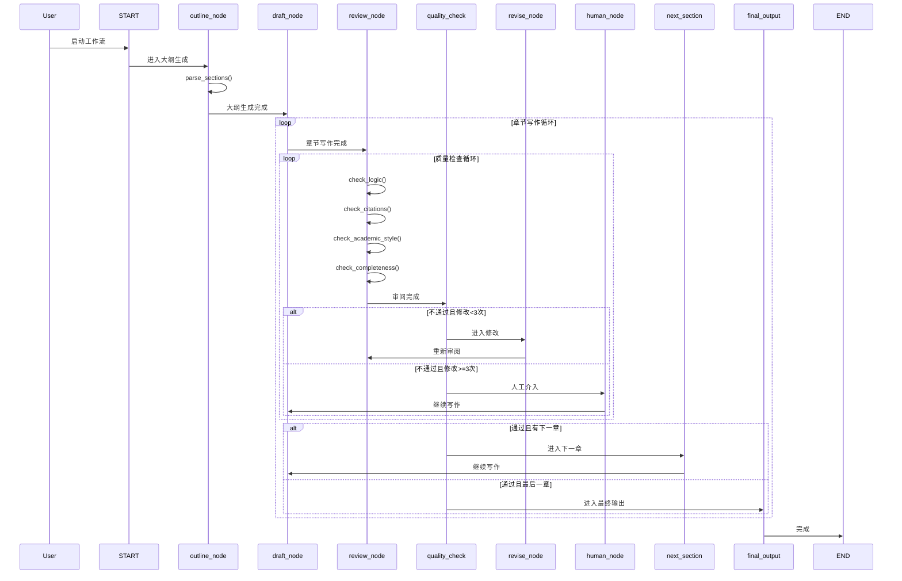
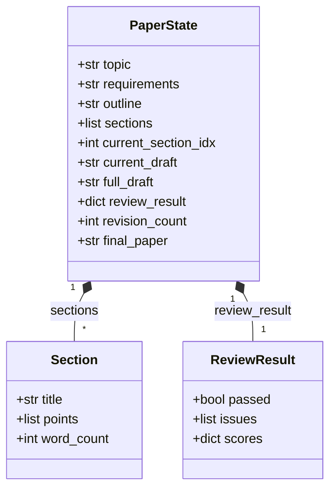

# 论文写作工作流架构图

## 1. ASCII 框架图

```
┌─────────────────────────────────────────────────────────────────────────────┐
│                         论文写作工作流 (Paper Writing Workflow)                │
└─────────────────────────────────────────────────────────────────────────────┘

                                    ┌─────────┐
                                    │  START  │
                                    └────┬────┘
                                         │
                                         ▼
                              ┌──────────────────────┐
                              │   outline_node       │
                              │   大纲生成节点        │
                              │  - 生成论文大纲       │
                              │  - 解析章节结构       │
                              └──────────┬───────────┘
                                         │
                                         ▼
                              ┌──────────────────────┐
                              │    draft_node        │
                              │   章节写作节点        │
                              │  - 撰写当前章节       │
                              │  - 保持上下文连贯     │
                              └──────────┬───────────┘
                                         │
                                         ▼
                              ┌──────────────────────┐
                              │   review_node        │
                              │   智能审阅节点        │
                              │  - 逻辑连贯性检查     │
                              │  - 引用规范检查       │
                              │  - 学术风格检查       │
                              │  - 内容完整性检查     │
                              └──────────┬───────────┘
                                         │
                                         ▼
                              ┌──────────────────────┐
                              │   quality_check      │
                              │   质量检查/路由节点   │
                              │  (条件路由决策)       │
                              └────┬────┬────┬──────┬┘
                                   │    │    │      │
          ┌────────────────────────┘    │    │      └────────────────────────┐
          │                             │    │                                 │
          ▼                             │    │                                 ▼
┌─────────────────────┐                │    │                      ┌─────────────────────┐
│    revise_node      │                │    │                      │    human_node       │
│    修改完善节点      │◄───────────────┘    │                      │    人工介入节点      │
│  - 根据审阅意见修改  │                     │                      │  - 打印审阅信息      │
│  - 计数+1           │                     │                      │  - 人工审核标记      │
└──────────┬──────────┘                     │                      └──────────┬──────────┘
           │                               │                                 │
           └───────────────────────────────┘                                 │
                      (内循环：修改→审阅)                                      │
                                                                             │
           ┌─────────────────────────────────────────────────────────────────┘
           │
           ▼
┌─────────────────────┐
│   next_section      │
│   下一章节节点       │
│  - 章节索引+1       │
│  - 重置修改计数     │
└──────────┬──────────┘
           │
           │
           └──────────────────────────────────────────┐
                      (外循环：下一章→写作)            │
                                                      │
           ┌──────────────────────────────────────────┘
           │
           ▼
┌─────────────────────┐
│   final_output      │
│   最终输出节点       │
│  - 整合所有内容     │
│  - 生成最终论文     │
└──────────┬──────────┘
           │
           ▼
        ┌──────┐
        │ END  │
        └──────┘
```

## 2. Mermaid 流程图

### 2.1 基础流程图



### 2.2 详细状态流转图



### 2.3 时序图



## 3. 状态数据结构



## 4. 节点功能对照表

| 节点名称 | 函数 | 输入状态 | 输出状态 | 说明 |
|---------|------|---------|---------|------|
| outline_node | [`outline_node()`](play_paper.py:185) | topic, requirements | outline, sections | 生成论文大纲 |
| draft_node | [`draft_node()`](play_paper.py:220) | sections, current_section_idx | current_draft, full_draft | 撰写当前章节 |
| review_node | [`review_node()`](play_paper.py:276) | current_draft | review_result | 多维度审阅 |
| quality_check | [`quality_check()`](play_paper.py:298) | review_result, revision_count | 路由决策 | 条件路由 |
| revise_node | [`revise_node()`](play_paper.py:326) | current_draft, review_result | current_draft, revision_count | 修改完善 |
| next_section | [`next_section()`](play_paper.py:367) | current_section_idx | current_section_idx, revision_count | 推进章节 |
| human_node | [`human_node()`](play_paper.py:389) | 当前状态 | 更新状态 | 人工介入 |
| final_output | [`final_output_node()`](play_paper.py:415) | full_draft, outline | final_paper | 最终输出 |

## 5. 循环逻辑说明

### 内循环（修改-审阅循环）
```
review_node -> quality_check -> revise_node -> review_node
```
- 当质量检查不通过且修改次数 < 3 时触发
- 每次循环 `revision_count += 1`
- 直到质量通过或超过最大修改次数

### 外循环（章节迭代循环）
```
draft_node -> review_node -> quality_check -> next_section -> draft_node
```
- 当当前章节通过且有下一章时触发
- 每次循环 `current_section_idx += 1`
- `revision_count` 重置为 0

### 人工介入流程
```
review_node -> quality_check -> human_node -> draft_node
```
- 当超过最大修改次数仍未通过时触发
- 打印审阅信息，标记人工审核后继续

## 6. 代码文件

- **主代码**: [`play_paper.py`](play_paper.py)
- **架构文档**: [`play_paper_architecture.md`](play_paper_architecture.md) (本文档)
