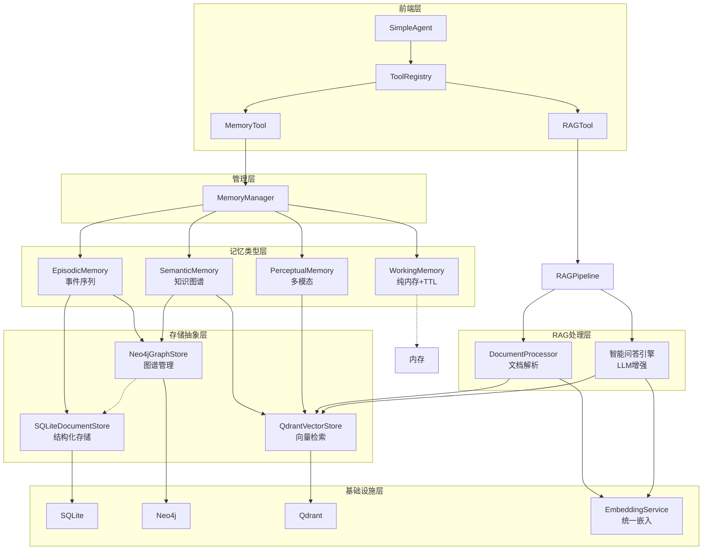
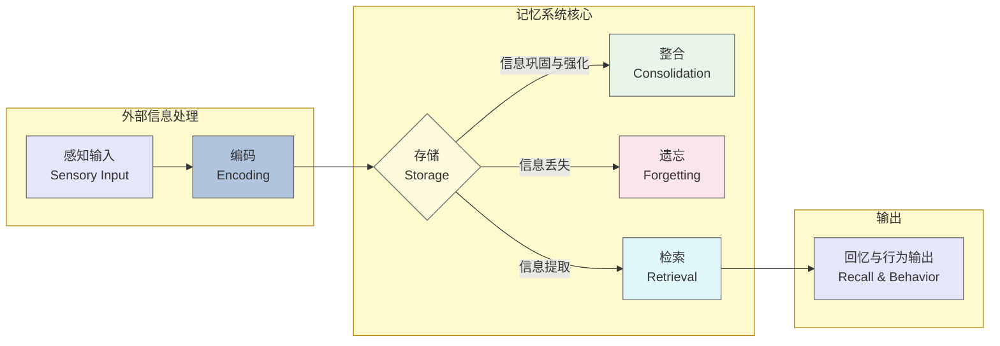
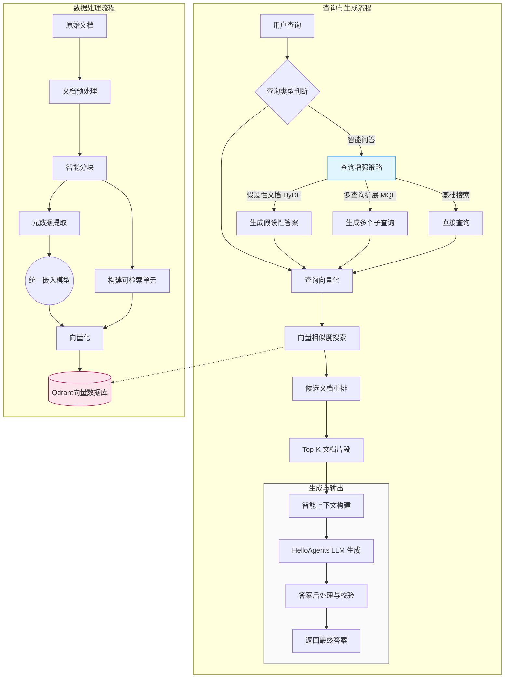
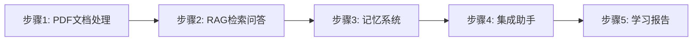

# Chap 8


框架扩展+知识科普


## 8.1 从认知科学到智能体记忆


1. 感觉记忆(Sensory Memory): 持续时间极短(0.5~3秒)，容量巨大，负责暂时保存感官接收到的所有信息 
2. 短期记忆(Working Memory): 持续时间段(15~30秒), 容量有限(7+-2个项目)，负责当前任务的信息处理
3. 长期记忆(Long-term Memory): 持续时间长(可达终生)，容量几乎无限，进一步分为
   1. 程序记忆：技能和习惯
   2. 陈述性记忆： 可用语言表达的知识
      1. 语义记忆: 一般知识和概念
      2. 情景记忆：个人经历和事件


为何需要记忆与RAG: LLM本身就是无状态的，所以会造成以下问题
- 上下文丢失
- 个性化缺失
- 学习能力受限：无法从过往的成功或失败经验中学习改进  --> skill 
- 一致性问题: 在多轮对话中可能前后矛盾的回答 --> wiki-memory 

LLM预训练受到预训练知识的范围限制
- 知识的时效性
- 专业领域知识：通用模型在特定领域的深度知识可能不足
- 事实准确性: 通过检索验证，减少模型的幻觉问题   --> tools  function call
- 可解释性 --> pretrain next token的本质


记忆与RAG系统架构设计

记忆-`memory_tool`: 负责存储和维护对话过程中的交互信息
RAG-`rag_tool`: 负责从用户提供的知识库中检索相关信息上下文，并可以将重要的检索结果自动存储到记忆系统中



四层架构设计
1. 基础设施-Infrastucture Layer
   1. MemoryManager 记忆管理器 —— 统一调度和协调
   2. MemoryItem 记忆数据结构 —— 标准记忆项
   3. MemoryConfig 配置管理 —— 系统参数设置
   4. BaseMemory 基础记忆 —— 通用接口定义
2. 记忆类型层-Memory Types Layer
   1. WorkingMemory - 工作记忆 —— 临时信息 TTL管理
   2. EpisodicMemory - 情景记忆 —— 具体时间 时间序列
   3. SemanticMemory - 语义记忆 —— 抽象知识 图谱关系
   4. PreceptualMemory - 感知记忆 —— 多模态数据
3. 存储后端层-Storage Backend Layer
   1. QdrantVectorStore - 向量存储 —— 高性能语义检索
   2. Neo4jGraphStore - 图存储 —— 知识图谱管理
   3. SQLiteDocumentStore - 文档存储 —— 结构化持久化
4. 嵌入服务层-Embedding Service Layer
   1. DashScopeEmbedding - 通义千问嵌入 —— 云端API
   2. LocalTransformerEmbedding - 本地嵌入 —— 离线部署
   3. TFIDFEmbedding - TFIDF嵌入 —— 轻量级兜底

RAG系统专注于外部知识的获取和利用
1. 文档处理层 - Document Processing Layer
   1. DocumentProcessor - 文档处理器 —— 多格式解析
   2. Document - 文档对象 —— 元数据管理
   3. Pipeline - RAG管道 —— 端到端处理
2. 嵌入表示层 Embedding Layer
   1. 统一嵌入接口 - 复用记忆系统的嵌入服务
3. 向量存储层 Vector Storage Layer
   1. QdrantVectorStore - 向量数据库（命名空间隔离）
4. 智能问答层 (Intelligent Q&A Layer)
   1. 多策略检索 - 向量检索 + MQE + HyDE
   2. 上下文构建 - 智能片段合并与截断
   3. LLM增强生成 - 基于上下文的准确问答


## 8.2 记忆系统：让智能体拥有记忆




1. 编码(Encoding): 将感知的信息转换为可存储的形式
2. 存储（Storage）：将编码后的信息保存在记忆系统中
3. 检索（Retrieval）：根据需要从记忆中提取相关信息
4. 整合（Consolidation）：将短期记忆转化为长期记忆
5. 遗忘（Forgetting）：删除不重要或过时的信息

基于人记忆习惯设计3个功能

- 添加记忆
  - 自动分类
    - Working 临时信息 -> 内存存储TTL管理
      - (相关性 × 时间衰减) × (0.8 + 重要性 × 0.4)
    - Episodic 具体事件 -> SQLite + Qdrant 
    - Semantic 抽象知识 -> Qdrant + Node4j知识图谱
    - Perceptual 多模态 -> SQLite + Qdrant 多模态向量
- 搜索记忆
  - 跨类型并行检索->老记忆类型.retrieve->结果聚合与排序->返回TopK记忆
- 管理操作
  - 管理策略：记忆聚合、智能遗忘多策略清理、统计分析跨类型汇总

## 8.3 RAG系统：知识检索增强


**发展历程：**
1. 朴素RAG (Native RAG, 2020-2021)。这是RAG技术的萌芽阶段，其流程直接而简单，通常被称为"检索-读取"(Retrieve-Read)模式。
   1. 检索方式：传统的关键词匹配算法`TF-IDF` 或 `BM25`
   2. 生成模式：将检索到的文档内容不加处理地直接拼接到提示词的上下文中，然后送给生成模型
2. 高级RAG (Advanced RAG, 2022-2023)。
   1. 检索方式：稠密嵌入(`Dense Embedding`)的语义检索
   2. 生成模式：引入了很多优化技术，例如查询重写，文档分块，重排序等
3. 模块化RAG(Modular RAG, 2023-至今)
   1. 检索方式：如混合检索，多查询扩展，假设性文档嵌入等。
   2. 生成模式：思维链推理，自我反思与修正等


**工作原理**




**RAG系统架构设计**
"五层七步"的设计模式
1. 用户层：RAGTool统一接口
2. 应用层：智能问答、搜索、管理  
3. 处理层：文档解析、分块、向量化
   1. `_convert_to_markdown`: 系统使用MarkItDown作为统一的文档转换引擎，支持几乎所有常见的文档格式。MarkItDown是微软开源的通用文档转换工具，它是HelloAgents RAG系统的核心组件，负责将任意格式的文档统一转换为结构化的Markdown文本
   2. markdown结构感知的分块流程
```text
标准Markdown文本 → 标题层次解析 → 段落语义分割 → Token计算分块 → 重叠策略优化 → 向量化准备
       ↓                ↓              ↓            ↓           ↓            ↓
   统一格式          #/##/###        语义边界      大小控制     信息连续性    嵌入向量
   结构清晰          层次识别        完整性保证    检索优化     上下文保持    相似度匹配
```
4. 存储层：向量数据库、文档存储
5. 基础层：嵌入模型、LLM、数据库


**高级检索策略**

1. 多查询扩展（MQE） Multi-Query Expansion: 同一个问题可以有多种不同的表达方式，而不同的表述可能匹配到不同的相关文档。
2. 假设文档嵌入（HyDE）Hypothetical Document Embeddings : 用答案找答案——即使假设答案的内容不完全正确，它所包含的关键术语、概念和表述风格也能有效引导检索系统找到正确的文档
3. 统一的扩展检索框架： 系统通过`enable_mqe`和`enable_hyde`参数让用户可以根据具体场景选择启用哪些策略：对于需要高召回率的场景可以同时启用两种策略，对于性能敏感的场景可以只使用基础检索


## 8.4 构建智能文档问答助手

实现下列功能：
1. 智能文档处理：使用MarkItDown实现PDF到Markdown的统一转换，基于Markdown结构的智能分块策略，高效的向量化和索引构建
2. 高级检索问答：多查询扩展（MQE）提升召回率，假设文档嵌入（HyDE）改善检索精度，上下文感知的智能问答
3. 多层次记忆管理：工作记忆管理当前学习任务和上下文，情景记忆记录学习事件和查询历史，语义记忆存储概念知识和理解，感知记忆处理文档特征和多模态信息
4. 个性化学习支持：基于学习历史的个性化推荐，记忆整合和选择性遗忘，学习报告生成和进度追踪




```python
class PDFLearningAssistant:
    """智能文档问答助手"""

    def __init__(self, user_id: str = "default_user"):
        """初始化学习助手

        Args:
            user_id: 用户ID，用于隔离不同用户的数据
        """
        self.user_id = user_id
        self.session_id = f"session_{datetime.now().strftime('%Y%m%d_%H%M%S')}"

        # 初始化工具
        self.memory_tool = MemoryTool(user_id=user_id)
        self.rag_tool = RAGTool(rag_namespace=f"pdf_{user_id}")

        # 学习统计
        self.stats = {
            "session_start": datetime.now(),
            "documents_loaded": 0,
            "questions_asked": 0,
            "concepts_learned": 0
        }

        # 当前加载的文档
        self.current_document = None

def load_document(self, pdf_path: str) -> Dict[str, Any]:
    """加载PDF文档到知识库

    Args:
        pdf_path: PDF文件路径

    Returns:
        Dict: 包含success和message的结果
    """
    if not os.path.exists(pdf_path):
        return {"success": False, "message": f"文件不存在: {pdf_path}"}

    start_time = time.time()

    # 【RAGTool】处理PDF: MarkItDown转换 → 智能分块 → 向量化
    result = self.rag_tool.execute(
        "add_document",
        file_path=pdf_path,
        chunk_size=1000,
        chunk_overlap=200
    )

    process_time = time.time() - start_time

    if result.get("success", False):
        self.current_document = os.path.basename(pdf_path)
        self.stats["documents_loaded"] += 1

        # 【MemoryTool】记录到学习记忆
        self.memory_tool.execute(
            "add",
            content=f"加载了文档《{self.current_document}》",
            memory_type="episodic",
            importance=0.9,
            event_type="document_loaded",
            session_id=self.session_id
        )

        return {
            "success": True,
            "message": f"加载成功！(耗时: {process_time:.1f}秒)",
            "document": self.current_document
        }
    else:
        return {
            "success": False,
            "message": f"加载失败: {result.get('error', '未知错误')}"
        }

def ask(self, question: str, use_advanced_search: bool = True) -> str:
    """向文档提问

    Args:
        question: 用户问题
        use_advanced_search: 是否使用高级检索（MQE + HyDE）

    Returns:
        str: 答案
    """
    if not self.current_document:
        return "⚠️ 请先加载文档！"

    # 【MemoryTool】记录问题到工作记忆
    self.memory_tool.execute(
        "add",
        content=f"提问: {question}",
        memory_type="working",
        importance=0.6,
        session_id=self.session_id
    )

    # 【RAGTool】使用高级检索获取答案
    answer = self.rag_tool.execute(
        "ask",
        question=question,
        limit=5,
        enable_advanced_search=use_advanced_search,
        enable_mqe=use_advanced_search,
        enable_hyde=use_advanced_search
    )

    # 【MemoryTool】记录到情景记忆
    self.memory_tool.execute(
        "add",
        content=f"关于'{question}'的学习",
        memory_type="episodic",
        importance=0.7,
        event_type="qa_interaction",
        session_id=self.session_id
    )

    self.stats["questions_asked"] += 1

    return answer

    # 笔记记录、学习回顾、统计查看和报告生成
def add_note(self, content: str, concept: Optional[str] = None):
    """添加学习笔记"""
    self.memory_tool.execute(
        "add",
        content=content,
        memory_type="semantic",
        importance=0.8,
        concept=concept or "general",
        session_id=self.session_id
    )
    self.stats["concepts_learned"] += 1

def recall(self, query: str, limit: int = 5) -> str:
    """回顾学习历程"""
    result = self.memory_tool.execute(
        "search",
        query=query,
        limit=limit
    )
    return result

def get_stats(self) -> Dict[str, Any]:
    """获取学习统计"""
    duration = (datetime.now() - self.stats["session_start"]).total_seconds()
    return {
        "会话时长": f"{duration:.0f}秒",
        "加载文档": self.stats["documents_loaded"],
        "提问次数": self.stats["questions_asked"],
        "学习笔记": self.stats["concepts_learned"],
        "当前文档": self.current_document or "未加载"
    }

def generate_report(self, save_to_file: bool = True) -> Dict[str, Any]:
    """生成学习报告"""
    memory_summary = self.memory_tool.execute("summary", limit=10)
    rag_stats = self.rag_tool.execute("stats")

    duration = (datetime.now() - self.stats["session_start"]).total_seconds()
    report = {
        "session_info": {
            "session_id": self.session_id,
            "user_id": self.user_id,
            "start_time": self.stats["session_start"].isoformat(),
            "duration_seconds": duration
        },
        "learning_metrics": {
            "documents_loaded": self.stats["documents_loaded"],
            "questions_asked": self.stats["questions_asked"],
            "concepts_learned": self.stats["concepts_learned"]
        },
        "memory_summary": memory_summary,
        "rag_status": rag_stats
    }

    if save_to_file:
        report_file = f"learning_report_{self.session_id}.json"
        with open(report_file, 'w', encoding='utf-8') as f:
            json.dump(report, f, ensure_ascii=False, indent=2, default=str)
        report["report_file"] = report_file

    return report

```

- 用户询问"我之前加载过哪些文档？" → 从情景记忆中检索
- 系统可以追踪用户的学习历程和文档使用情况

## 8.5 总结与展望

HelloAgents框架增加了两个核心能力: 记忆系统和RAG系统


