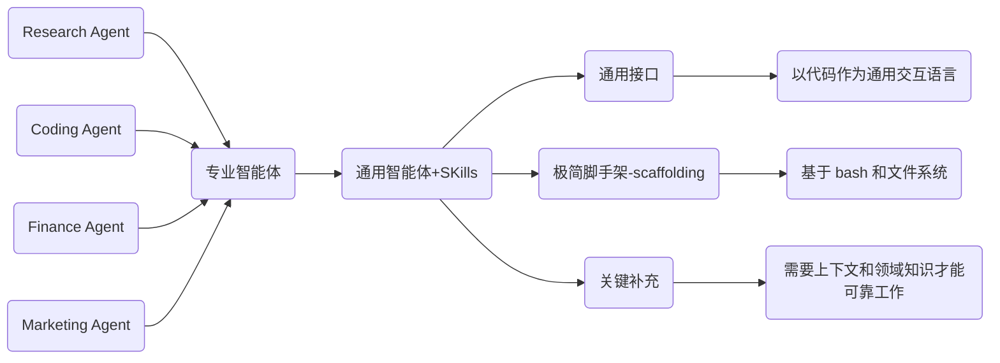

# Skill 学习记录


> **课程来源**: [DeepLearning.AI - Agent Skills with Anthropic](https://www.deeplearning.ai/short-courses/agent-skills-with-anthropic/)  
> **讲师**: Elie Schoppik (Anthropic 技术教育负责人)  
> **合作方**: DeepLearning.AI × Anthropic  
> **课程时长**: 约2小时19分钟 (10个视频课程)  
> **难度级别**: 初级  
> **Github**:  [sc-agent-skills-files](https://github.com/https-deeplearning-ai/sc-agent-skills-files/tree/main)


## 一、课程概述

本课程系统讲解了 **Agent Skills** —— 一种遵循开放标准的指令文件夹格式，可赋予AI Agent专业能力并自动化工作流。Skills是包含指令的文件夹，能够扩展Agent的能力，为其提供专业领域知识。开发者可以将特定工作流程打包成独立的技能模块，实现"一次构建，多处部署"。

### 核心学习目标

- ✅ 使用开放标准格式和最佳实践创建可复用的Skills
- ✅ 构建代码生成与审查、数据分析、研究等自定义Skills
- ✅ 将Skills与MCP和子代理结合，创建具有专业知识的强大Agent系统
- ✅ 在Claude.ai、Claude Code、Claude API和Claude Agent SDK中部署相同的Skills

---

## 二、课程大纲

| 序号 | 章节编码 | 课程名称 | 时长 | 主要内容 |
|------|------|----------|------|----------|
| 1 | | Introduction | 2分钟 | 课程介绍与概览 |
| 2 | | Course Materials | 1分钟 | 课程资料说明 |
| 3 | 三| Why Use Skills - Part I| 11分钟 | 为什么使用Skills（上） |
| 4 | 三 | Why Use Skills - Part II | 8分钟 | 为什么使用Skills（下） |
| 5 | 四 | Skills vs Tools, MCP, and Subagents | 7分钟 | Skills与Tools、MCP、子代理的对比 |
| 6 | 五 | Exploring Pre-Built Skills | 18分钟 | 探索预置Skills |
| 7 | 六 | Creating Custom Skills | 16分钟 | 创建自定义Skills |
| 8 | 七 | Skills with the Claude API | 17分钟 | 在Claude API中使用Skills |
| 9 | 八 | Skills with Claude Code | 24分钟 | 在Claude Code中使用Skills |
| 10 |九 | Skills with the Claude Agent SDK | 20分钟 | 在Claude Agent SDK中使用Skills |
| 11 | | Conclusion | 1分钟 | 课程总结 |


## 三、Why Use Skills

### 3.1 **认知演进：从专用到通用**




使用skill的核心价值: **<font color=darkred>提供程序性知识 + 公司/团队/用户特定的上下文，支持按需加载。</font>**

---

### 3.2 Skill 能做什么

| 能力类别       | 具体示例                              |
| ---------- | --------------------------------- |
| **领域专业知识** | 品牌规范与模板、法律审查流程、数据分析方法论            |
| **可复用工作流** | 每周营销活动复盘、客户电话准备流程、季度业务回顾          |
| **新能力扩展**  | 创建演示文稿、生成 Excel/PDF 报告、构建 MCP 服务器 |


没有 Skills 的痛点 
- ❌ 每次都要手动打包所有参考资料
- ❌ 每次都要重复描述指令和需求
- ❌ 人工**确保工作流和输出的一致性**

--- 
### 3.3 Skills 的核心特性
> Agent Skills 现已成为开放标准，正被越来越多的智能体产品采纳。

1. 可移植性（Portable）: 同一个 Skill 可在多种支持 Skills 的智能体产品中复用：
   - Claude Code
   - Claude.ai
   - Claude Agent SDK
   - Claude API

2. 可组合性（Composable）
   - Skills 可组合构建复杂工作流：

```
公司品牌 Skill → 提供品牌规范（字体、配色、Logo）
      ↓
PowerPoint Skill → 创建幻灯片
      ↓
BigQuery Skill → 提供营销相关数据表结构
      ↓
营销活动分析 Skill → 分析数据并生成洞察
```
--- 
### 3.4 Skills 如何工作？渐进式披露机制
为避免占用过多上下文窗口，Skills 采用渐进式加载策略：

| 层级      | 内容                       | 加载时机  |
| ------- | ------------------------ | ----- |
| **Level 1 - Metadata/元数据** | YAML frontmatter（name + description）  | 始终加载(~100 tokens/技能)  |
| **Level 2 - SKILL.md Body/指令**  | SKILL.md 主体内容            | 触发时加载(~5k tokens) |
| **Level 3 - Linked Files/资源**  | 参考文件、脚本等(references/、scripts/、assets/中的文件)    | 按需加载  |

### 3.5 Skills 目录结构示例

> 注：部分 Skills 开发于标准确立之前，格式可能不完全统一（如下方 PDF Skill）。

根据 Agent Skills 规范：
- 必需：`SKILL.md`
- 可选：`references/、scripts/、assets/` 目录


```bash
your-skill-name/
├── SKILL.md              # 必需 - 主要技能文件（YAML frontmatter + Markdown）
├── scripts/              # 可选 - 可执行代码（Python、Bash等）
│   ├── process_data.py
│   └── validate.sh
├── references/           # 可选 - 参考文档
│   ├── api-guide.md
│   └── examples/
└── assets/               # 可选 - 模板等资源
    └── report-template.md
```
---

## 四、Skills与Tools、MCP、子代理的对比

核心对比：四者关系图谱
```
┌─────────────────────────────────────────────────────────────────┐
│                    Agent 能力栈                                  │
├───────────────┬───────────────┬───────────────┬─────────────────┤
│    MCP        │    Tools      │   Skills      │  Subagents      │
│  (连接层)      │  (基础能力)   │  (专业知识)    │   (分工协作)     │
├───────────────┼───────────────┼───────────────┼─────────────────┤
│ 连接外部系统   │ 提供核心功能   │ 传授做事方法   │  独立处理子任务  │
│ 数据库/API/服务│ 文件操作/搜索  │ 领域最佳实践   │  并行+隔离上下文 │
└───────────────┴───────────────┴───────────────┴─────────────────┘
         ↓              ↓              ↓                ↓
    "能访问什么"    "能做什么"      "知道怎么做"       "谁来执行"

```

### 4.1 详细对比

Skills vs MCP

| 维度       | MCP                       | Skills                      |
| -------- | ------------------------- | --------------------------- |
| **核心目的** | 连接智能体与外部系统和数据（数据库、API、服务） | 教智能体**如何处理**这些数据            |
| **典型示例** | MCP Server 连接到数据库         | Skill 规定："使用表的 A、B 列计算指标 X" |
| **本质区别** | **提供访问权限**                | **提供专业知识**                  |

> 💡 一句话总结：MCP 解决"能不能访问"，Skills 解决"访问后怎么做"。
--- 

Skills vs Tools
| 维度        | Tools                          | Skills                         |
| --------- | ------------------------------ | ------------------------------ |
| **核心目的**  | **为智能体提供完成任务的基础能力**    | 用专业知识扩展智能体能力                   |
| **上下文管理** | Tool 定义（名称、描述、参数）**始终占用**上下文窗口 | Skills **动态按需加载**              |
| **灵活性**   | 固定能力集合                         | 可包含脚本作为"按需工具"（tools on demand） |

> 💡 关键差异：Tools 是常驻基础设施，Skills 是弹性知识库。
--- 

Skills vs Subagents

| 维度       | Subagents                       | Skills             |
| -------- | ------------------------------- | ------------------ |
| **核心目的** | 拥有独立的上下文和工具权限                   | 向主智能体或其子智能体提供专业知识  |
| **工作方式** | 主智能体委派任务，子智能体**独立执行**（可并行），返回结果 | **指导**工作应如何完成      |
| **典型示例** | Code Reviewer 子智能体              | 特定语言或框架的最佳实践 Skill |
| **作用范围** | 任务执行层                           | 知识赋能层              |

> 💡 协同关系：Skills 可同时增强主智能体和其子智能体的专业能力。

--- 

Summary 

| Features       | Skills                       | Prompts             | Subagents             | MCP             |
| -------- | ------------------------------- | ------------------ | ------------------ | ------------------ |
| 提供了什么  | 程序性知识(Procedural knowledge)  |  即时指令(Moment-to-moment instructions)  |  任务分配(Task delegation) | 工具连接(Tool connective) | 
| 保持情况(Persistence) | 所有对话中(Across conversations) | 单个对话(Single conversations)  |  跨会话保持(Across sessions) |  持续连接(Continuous connection) |
| 包含内容|  Instructions + Code + assets    |  自然语音 | 整个agent逻辑 | 工具定义(Tool definitions)  |
| 什么时候载入 |  需要时动态载入 | 每轮交互  | 被调触发时 | 随时可用 |
|Best for | 专业知识(Specialized expertise) | 快速询问  | 专项任务(Specialized tasks) | 数据访问(Data access) | 


### 4.2 整合应用：客户洞察分析器示例

```
┌────────────────────────────────────────────────────────────┐
│              Customer Insight Analyzer（客户洞察分析器）     │
├────────────────────────────────────────────────────────────┤
│  📋 Skill: 客户反馈分类指南 + 调研结果总结方法论              │
│     └── 规定如何打标签、如何提炼关键发现                      │
├────────────────────────────────────────────────────────────┤
│  🔌 MCP Server: Google Drive MCP                           │
│     └── 访问存放客户访谈记录和问卷回复的 Drive 文件夹          │
├────────────────────────────────────────────────────────────┤
│  🤖 Subagents:                                            │
│     ├── Interview Analyzer（访谈分析子智能体）← 加载 Skill   │
│     └── Survey Analyzer（问卷分析子智能体）   ← 加载同一 Skill │
│     [并行处理，各自隔离上下文，结果汇总至主智能体]             │
└────────────────────────────────────────────────────────────┘
```


| 组件             | 角色定位                                           |
| -------------- | ---------------------------------------------- |
| **Skill**      | 指导反馈分类方法和调研总结规范                                |
| **MCP Server** | Google Drive MCP，访问客户访谈记录和问卷回复                 |
| **Subagents**  | Interview Analyzer（访谈分析）、Survey Analyzer（问卷分析） |

### 4.3 关系总结

```
数据访问 ──────► 做事方法 ──────► 具体执行
   │               │              │
   ▼               ▼              ▼
  MCP            Skills      Tools/Subagents
 (桥梁)          (大脑)         (手脚)
```

- MCP：打通外部世界，解决数据来源问题
- Skills：沉淀专业知识，解决方法论问题
- Tools：提供原子能力，解决功能有无问题
- Subagents：实现任务分解，解决规模化协作问题


## 五、Exploring Pre-Built Skills

1. [anthropics/skills](https://github.com/anthropics/skills/tree/main)
   1. 主要是pptx的skill

## 六、Creating Custom Skills

### 6.1 Skill的结构详解

一个 Skill 文件包含两个主要部分：
- YAML Frontmatter — 顶部的元数据
- Body Content — 下方的 Markdown 指令内容


```markdown
---
name: my-skill                    # 技能名称（kebab-case）
description: 简要描述技能功能和触发时机  # 关键：说明"做什么"和"何时使用"
metadata:
      author: xxx
      version: "1.0"
---

```

#### 1) YAML Frontmatter

| 是否必需 | 字段            | 约束条件                                                             |
| ------  | ------------- | ---------------------------------------------------------------- |
|  是✅   | `name`        | 最多 64 字符；仅小写字母、数字、连字符；不能以连字符开头/结尾；必须与父目录名一致；建议使用动名词形式（verb+-ing） |
|  是✅   | `description` | 最多 1024 字符，非空；应描述 Skill 的功能**以及**使用时机；包含特定关键词以帮助智能体识别相关任务        |
|  否     | `license`       | 许可证名称或引用许可证文件       |
|  否     | `compatibility` | 最多 500 字符，说明环境要求    |
|  否     | `metadata`      | 任意键值对（如作者、版本）       |
|  否     | `allowed-tools` | 空格分隔的预批准工具列表（实验性功能） |


description 关键技巧：
- 包含用户会说的具体短语（“冲刺规划”“创建任务”“设计规范”）
- 提到相关的文件类型（.fig、.csv、PDF）
- 说清楚适用场景，避免模糊表达


#### 2) Body Content
> 2026-02-24: Skill 的 Body Content 部分确实没有严格的统一规范


1 无固定格式限制，但建议包含以下部分
- 分步(Step-by-Step)指令 — 清晰的操作步骤
- 输入格式 / 输出格式 / 示例
- 常见边界情况

1.1 实用建议：
1. 控制在 500 行以内 | 保持简洁，避免过载   
2. 详细内容外移      | 基础内容在 SKILL.md，进阶内容链接到单独文件 
3. 引用文件保持一级深度  | 避免嵌套文件引用  
4. 清晰简洁，术语一致   | 降低理解成本    
5. 文件路径使用正斜杠   | 即使 Windows 也统一用 `/`  


2 根据约束强度，Skill 可分为三个等级：
1. 高自由度: 
   1. 通用文本指导；多种方法都有效 -> 创意写作、开放式分析
2. 中自由度	
   1. 包含可定制的伪代码、代码示例或模式；有推荐模式但允许一定变化 -> 数据处理、代码生成
3. 低自由度
   1. 引用特定脚本；必须遵循特定顺序 -> 合规检查、精确计算


2.1 复杂工作流处理
- 将复杂操作拆分为清晰的顺序步骤
- 如果步骤过多，考虑将工作流抽离到单独文件


3 一些平台的Body Content的隐性规范

| 平台/工具                  | Body Content 规范              | 说明                                 |
| ---------------------- | ---------------------------- | ---------------------------------- |
| **Claude / Anthropic** | 无强制规范，推荐结构化描述                | 重点在 `description` 和工具定义            |
| **Cursor**             | 无明确 Body 规范，依赖 `SKILL.md` 结构 | 强调 Purpose、Usage、Tools 等章节         |
| **Cline**              | 类似 Cursor，无强制 Body 格式        | 遵循 Cursor 的 Skill 规范               |
| **MCP 官方**             | 无 Body Content 概念，只有 Tool 定义 | 通过 `tools/list` 和 `tools/call` 交互  |
| **OpenAI Agents SDK**  | 无 Body，只有 `instructions` 字段  | 纯文本指令，无结构化要求                       |

#### 3) 可选目录

| /assets — 资产文件 | /references — 参考资料    | /scripts — 脚本 |
| ---- | --------- | --------- |
| 模板: 文档模板、配置模板 <br>  图片:流程图、Logo <br> 数据文件:查找表、数据表结构 | 包含智能体需要时可读取的附加文档 <br> 保持单个引用文件主题聚焦 <br>注意：超过 100 行的引用文件，顶部应添加目录，便于智能体了解全貌 | 清晰记录依赖项<br> 脚本应有明确的文档说明<br> 错误处理应显式且有帮助  |


### 6.2 评估与测试

1 单元测试  
定义测试用例需包含：
| 字段                  | 说明          |
| ------------------- | ----------- |
| `skills`            | 要测试的 Skills |
| `queries`           | 测试提示词       |
| `files`             | 使用的输入文件     |
| `expected_behavior` | 成功标准        |

2 测试用例示例

```json
{
  "skills": ["generating-practice-questions"],
  "queries": [
    "从这份讲义生成练习题并保存到 output.md",
    "从这份讲义生成练习题并保存到 output.tex",
    "从这份讲义生成练习题并保存到 output.pdf"
  ],
  "files": [
    "test-files/notes.pdf",
    "test-files/notes.tex", 
    "test-files/notes.pdf"
  ],
  "expected_behavior": [
    "成功读取并提取输入文件。PDF 输入时使用 pdfplumber。",
    "成功提取所有学习目标。",
    "生成 4 种题型。",
    "遵循每种题目的指导原则。",
    "使用正确的输出结构和模板。",
    "LaTeX 输出能成功编译。",
    "将生成的题目保存到名为 output 的文件。"
  ]
}
```

3 额外评估建议  
- ✅ 获取人工反馈  
- ✅ 在你计划使用的所有模型上进行测试  

## 七、Skills with the Claude API（在Claude API中使用Skills）


Jupyter Notebook + Claude API + Skills = 可编程的领域专家  
将"专业知识"（Skills）封装为可调用的服务，嵌入你的数据 pipeline，实现：  
- 自动化：批量处理，无需人工逐轮对话
- 可集成：与 PySpark、Pandas、可视化工具无缝衔接
- 可评估：量化 Skill 效果，持续迭代优化
- 可复现：代码即文档，实验可重复

[Kimi-code-api 使用示例](./P7_skill_with_the_kim_code_api.ipynb)


## 八、Skills with Claude Code （在Claude Code中使用Skills）


## 九、Skills with the Claude Agent SDK （在Claude Agent SDK中使用Skills）

 
## Reference

- [what-are-skills](https://agentskills.io/what-are-skills)
- [claude: how-skills-work](https://claude.com/app-unavailable-in-region#how-skills-work)


