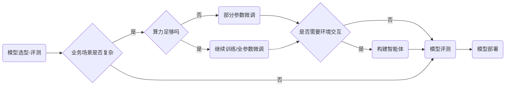
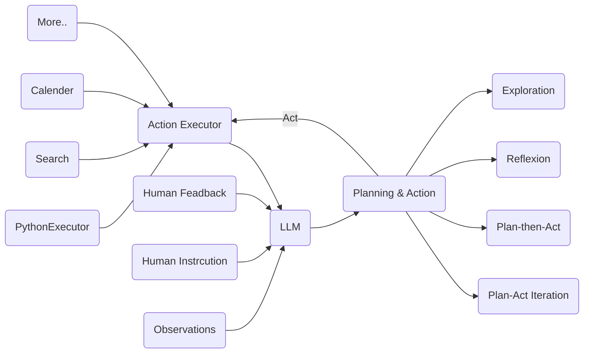

reference video: [bilibili-书生·浦语大模型全链路开源体系](https://www.bilibili.com/video/BV1Rc411b7ns/)
reference Github: [https://github.com/InternLM/tutorial](https://github.com/InternLM/tutorial)

# 一、从模型到应用

# 二、预训练`InternLM-Train`
并行训练
- 高可拓展 8~千卡，千卡加速 92%
- 极致优化`Hybrid Zero` 3600 tokens/sec/gpu, 加速50%
- 兼容主流： 无缝接入Huggingface
- 开箱即用：修改配置即可训练

# 三、微调`XTuner`

- 增量续训练
  - 使用场景：让base模型学习新的垂直领域知识
  - 训练数据：文章、书籍、代码等
- 有监督微调 `SFT`
  - 让模型学会理解和遵循各种指令
  - 训练数据：高质量的对话、问答数据
- `XTuner`
  - 优化QLoRA可以在8G显存的GPU上微调 InternLM-7B模型

# 四、评测`OpenCompass`
> 6大维度，80+评测集，40万+评测题目  
> 唯一国内开发者主要开发的大模型评测工具  
> Meta推荐的评测工具之一

- 学科
- 语音
- 知识
- 理解
- 推理
- 安全

# 五、部署`LMDeploy`

- 技术挑战
  - 低存储设备如何部署
  - 推理：如何加速；如何解决动态shape；如何有效管理和利用内存
  - 服务：提升系统整体吞吐量；降低请求的平均响应时间
- 部署方案
  - 模型并行
  - 低比特量化
  - Attention优化
  - 计算和访问优化
  - Continuous Batching

# 六、应用——智能体`Lagent`,`AgentLego`

大模型的局限性，需要Agent去引导优化

`Lagent`支持多种类型的智能体能力、支持多种大语言模型

多模态智能体工具箱`AgentLego`
- 丰富的工具集合
- 支持多个主流智能体系统，`LangChain`,`Transformers Agents`,`Lagent`
- 灵活的多模态工具调用接口
- 一键式远程工具部署
