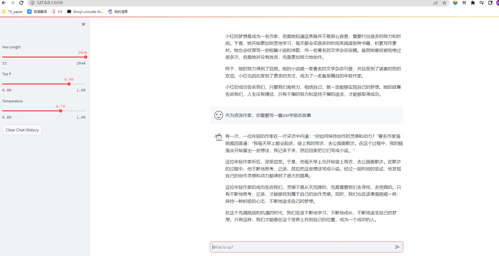
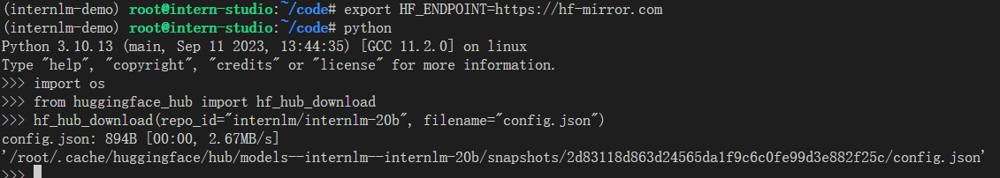
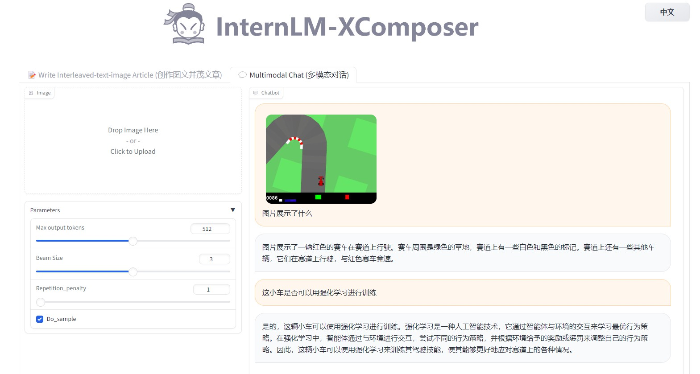
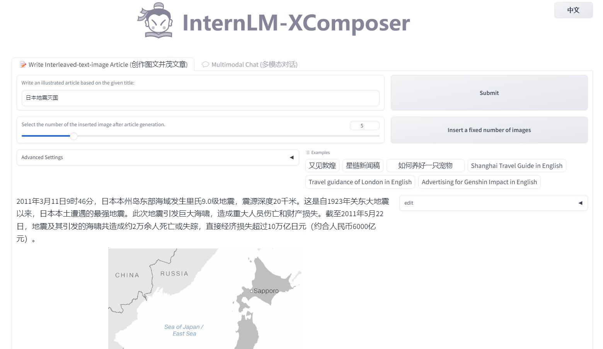
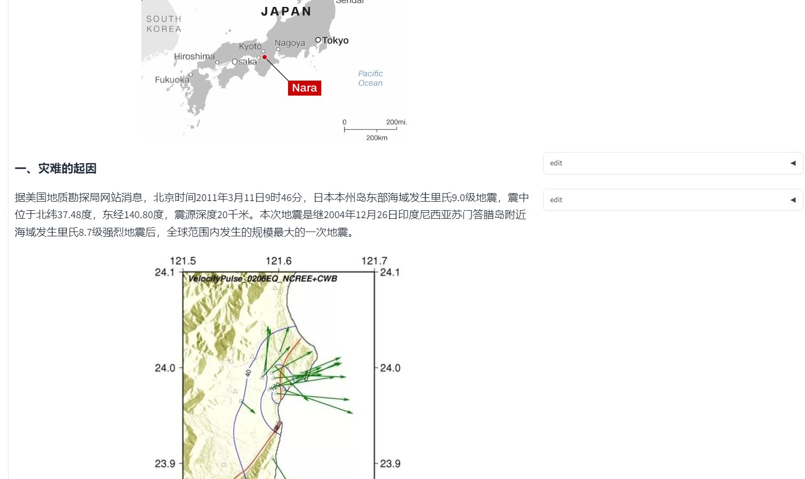
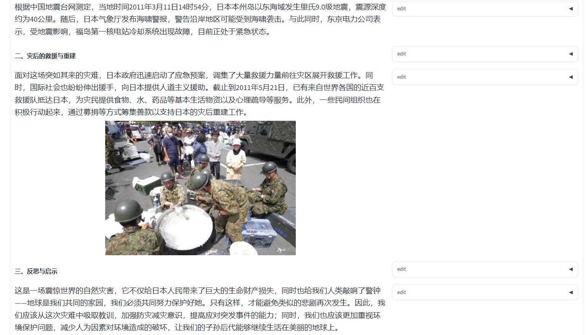
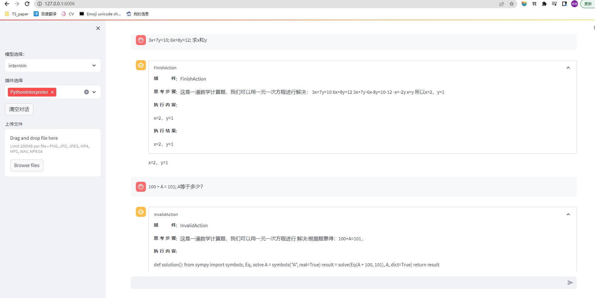

# 一、基础作业

- 使用 InternLM-Chat-7B 模型生成 300 字的小故。

- 熟悉 hugging face 下载功能，使用 huggingface_hub python 包，下载 InternLM-20B 的 config.json 文件到本地（需截图下载过程）。

# 二、进阶作业（可选做）

1. 完成浦语·灵笔的图文理解及创作部署（需截图）
  - 图文理解
  - 
  - 生成图文
  - 
2. 完成 Lagent 工具调用 Demo 创作部署（需截图）
