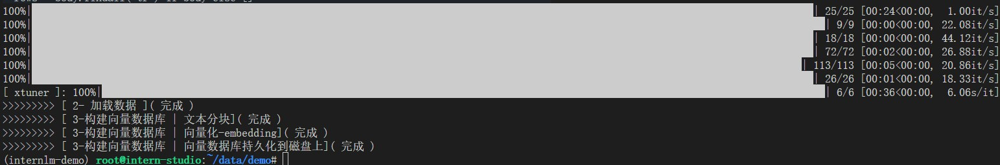
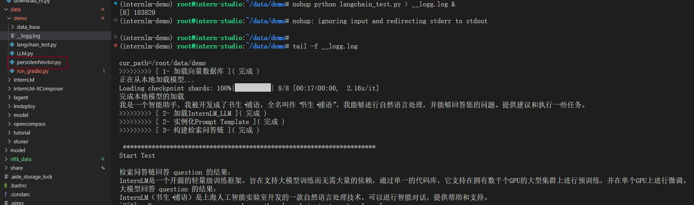
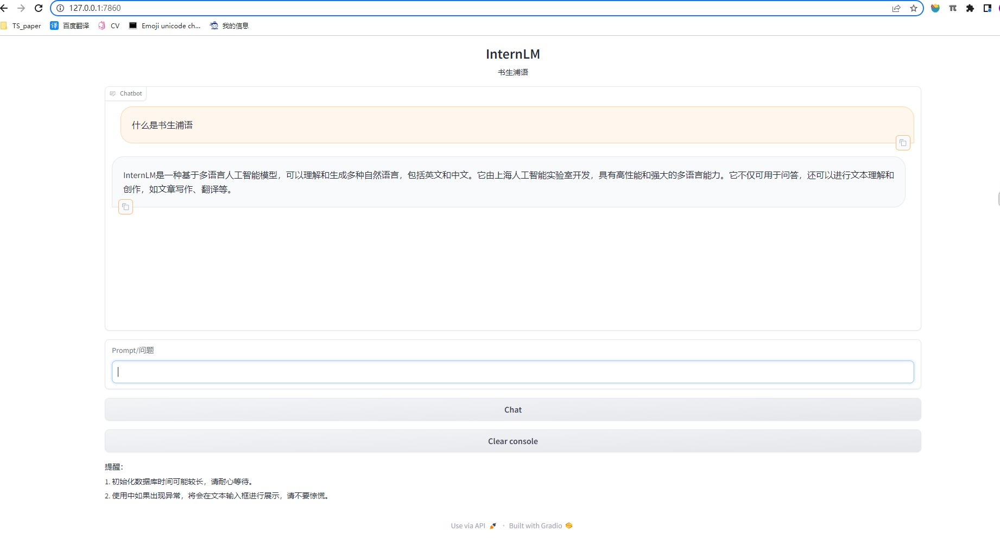

reference: [https://github.com/InternLM/tutorial/blob/main/langchain/readme.md](https://github.com/InternLM/tutorial/blob/main/langchain/readme.md)

# 1- 环境配置

1. 开源词向量模型下载

2. 下载 NLTK 相关资源

# 2- 知识库搭建

核心功能脚本都写到`persistentVector.py`，执行情况如下

# 3- InternLM 接入 LangChain
这部分主要是构建`LLM` 类，未截图，主要内容在笔记中

# 4- 构建检索问答链

1. 加载向量数据库
2. 实例化自定义 LLM 与 Prompt Template
3. 构建检索问答链

# 5- 部署 Web Demo

1. windows终端执行ssh连接
    - `ssh -CNg -L 7860:127.0.0.1:7860 root@ssh.intern-ai.org.cn -p xxxx`
2. 执行python
    - `nohup python run_gradio.py > __gr.log &`

