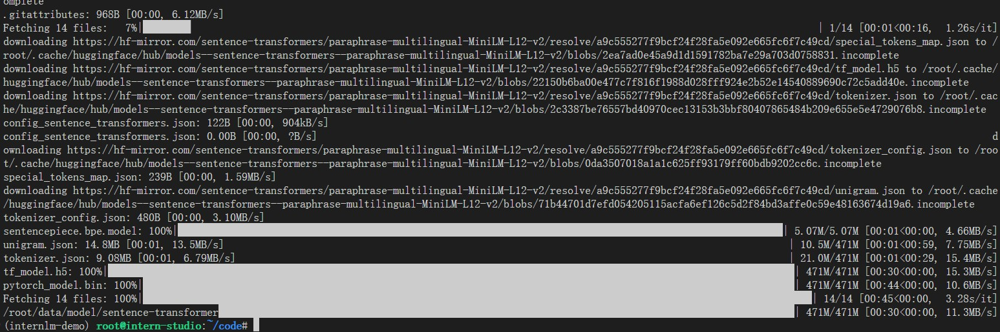
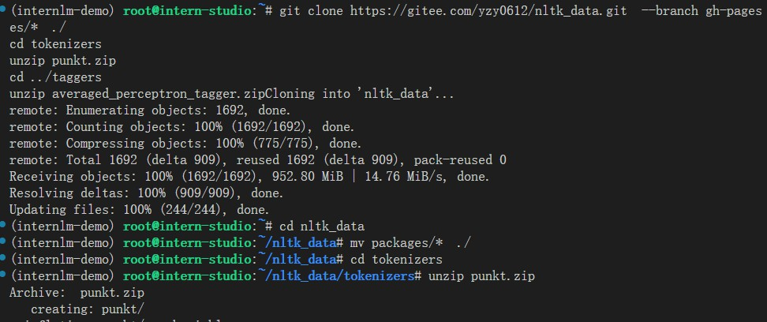
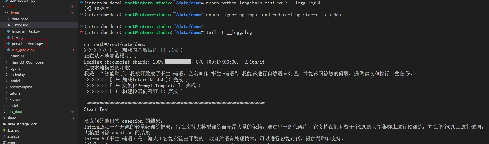

reference: [https://github.com/InternLM/tutorial/blob/main/langchain/readme.md](https://github.com/InternLM/tutorial/blob/main/langchain/readme.md)


# 1- 环境配置

## 1.3  LangChain 相关环境配置

```shell
pip install langchain==0.0.292
pip install gradio==4.4.0
pip install chromadb==0.4.15
pip install sentence-transformers==2.2.2
pip install unstructured==0.10.30
pip install markdown==3.3.7
```

1. 开源词向量模型 [Sentence Transformer](https://huggingface.co/sentence-transformers/paraphrase-multilingual-MiniLM-L12-v2)模型下载
```python
# download_hf.py
import os

os.environ['HF_ENDPOINT'] = 'https://hf-mirror.com'

# 下载模型
os.system('huggingface-cli download --resume-download sentence-transformers/paraphrase-multilingual-MiniLM-L12-v2 --local-dir /root/data/model/sentence-transformer')
```


2. 下载 NLTK 相关资源
```shell
cd /root
git clone https://gitee.com/yzy0612/nltk_data.git  --branch gh-pages
cd nltk_data
mv packages/*  ./
cd tokenizers
unzip punkt.zip
cd ../taggers
unzip averaged_perceptron_tagger.zip
```



# 2- 知识库搭建

1. clone上海人工智能实验室开源的一系列大模型工具开源仓库作为语料库来源，包括：
    - OpenCompass：面向大模型评测的一站式平台
    - IMDeploy：涵盖了 LLM 任务的全套轻量化、部署和服务解决方案的**高效推理工具箱**
    - XTuner：**轻量级微调大语言模型的工具库**
    - InternLM-XComposer：浦语·灵笔，基于书生·浦语大语言模型研发的视觉-语言大模型
    - Lagent：一个轻量级、开源的基于大语言模型的智能体（agent）框架
    - InternLM：一个开源的**轻量级训练框架**，旨在支持大模型训练而无需大量的依赖

```shell
# 进入到数据库盘
cd /root/data
# clone 上述开源仓库
git clone https://gitee.com/open-compass/opencompass.git
git clone https://gitee.com/InternLM/lmdeploy.git
git clone https://gitee.com/InternLM/xtuner.git
git clone https://gitee.com/InternLM/InternLM-XComposer.git
git clone https://gitee.com/InternLM/lagent.git
git clone https://gitee.com/InternLM/InternLM.git
```

2. 加载数据
   - `get_files`: 为语料处理方便，我们将选用上述仓库中所有的 markdown、txt 文件作为示例语料库
   - `get_text`: 使用 LangChain 提供的 FileLoader 对象来加载目标文件，得到由目标文件解析出的纯文本内容。由于不同类型的文件需要对应不同的 FileLoader，我们判断目标文件类型，并针对性调用对应类型的 FileLoader，同时，调用 FileLoader 对象的 load 方法来得到加载之后的纯文本对象

3. 构建向量数据库 [参考学习《LangChain - Chat With Your Data》](https://github.com/datawhalechina/llm-universe/tree/main)
    - 得到该列表之后，我们就可以将它引入到 LangChain 框架中构建向量数据库。
      - 由纯文本对象构建向量数据库，我们需要先对文本进行分块，接着对文本块进行向量化。
      - LangChain 提供了多种文本分块工具，此处我们使用字符串递归分割器`RecursiveCharacterTextSplitter`，并选择分块大小为`chunk_size=500`，块重叠长度为`chunk_overlap=150`
     - 用开源词向量模型`sentence-transformer`来进行文本向量化(`embedding`)
     - 选择 `Chroma` 作为向量数据库: 将语料加载到指定路径下的向量数据库


## 整体脚本

```python 
# persistentVector.py
import os
from tqdm.auto import tqdm
from langchain.document_loaders import UnstructuredFileLoader
from langchain.document_loaders import UnstructuredMarkdownLoader
from langchain.text_splitter import RecursiveCharacterTextSplitter
from langchain.embeddings.huggingface import HuggingFaceEmbeddings
from langchain.vectorstores import Chroma

def get_files(dir_path):
    """获取markdown & text文件
    """
    file_list = []
    for filepath, dirnames, filenames in os.walk(dir_path):
        for filename in filenames:
            if filename.endswith(".md") or filename.endswith(".txt"):
                file_list.append(os.path.join(filepath, filename))
    return file_list


def get_text(dir_path):
    """基于文件类型载入
    """
    file_lst = get_files(dir_path)
    docs = []
    for one_file in tqdm(file_lst):
        file_type = one_file.split('.')[-1]
        if file_type == 'md':
            loader = UnstructuredMarkdownLoader(one_file)
        elif file_type == 'txt':
            loader = UnstructuredFileLoader(one_file)
        else:
            continue
        docs.extend(loader.load())
    return docs

# 2- 加载数据
tar_dir = [
    "/root/data/InternLM",
    "/root/data/InternLM-XComposer",
    "/root/data/lagent",
    "/root/data/lmdeploy",
    "/root/data/opencompass",
    "/root/data/xtuner"
]
docs = []
tar_dir_bar = tqdm(tar_dir, total=len(tar_dir))
for dir_path in tar_dir_bar:
    proj_ = dir_path.split('/')[-1]
    tar_dir_bar.set_description(f"[ {proj_} ]")
    docs.extend(get_text(dir_path))

print('>>>>>>>>> [ 2- 加载数据 ]( 完成 )')
# 3- 构建向量数据库
## 3.1 文本分块
text_splitter = RecursiveCharacterTextSplitter(
    chunk_size=500, chunk_overlap=150)
split_docs = text_splitter.split_documents(docs)
print('>>>>>>>>> [ 3-构建向量数据库 | 文本分块]( 完成 )')
## 3.2 向量化-embedding模型
embeddings = HuggingFaceEmbeddings(model_name="/root/data/model/sentence-transformer")
print('>>>>>>>>> [ 3-构建向量数据库 | 向量化-embedding]( 完成 )')
## 3.3 语料加载到指定路径下的向量数据库
# 定义持久化路径
persist_directory = 'data_base/vector_db/chroma'
## 加载数据库
vectordb = Chroma.from_documents(
    documents=split_docs,
    embedding=embeddings,
    persist_directory=persist_directory  # 允许我们将persist_directory目录保存到磁盘上
)
# 将加载的向量数据库持久化到磁盘上
vectordb.persist()
print('>>>>>>>>> [ 3-构建向量数据库 | 向量数据库持久化到磁盘上]( 完成 )')
```
执行情况：


# 3- InternLM 接入 LangChain

核心就是继承 LangChain 的 LLM 类自定义一个 InternLM LLM 子类
- `LangChain.llms.base.LLM` 类继承一个子类
- 重写构造函数: 就是通过`transformers`进行`InternLM`预训练模型加载, 并设置成`model.eval()`锁定参数
-  `_call` 函数：就是调用预训练模型的方法

```python
#  LLM.py
from langchain.llms.base import LLM
from typing import Any, List, Optional
from langchain.callbacks.manager import CallbackManagerForLLMRun
from transformers import AutoTokenizer, AutoModelForCausalLM
import torch


class InternLM_LLM(LLM):
    # 基于本地 InternLM 自定义 LLM 类
    tokenizer : AutoTokenizer = None
    model: AutoModelForCausalLM = None

    def __init__(self, model_path :str):
        # model_path: InternLM 模型路径
        # 从本地初始化模型
        super().__init__()
        print("正在从本地加载模型...")
        self.tokenizer = AutoTokenizer.from_pretrained(model_path, trust_remote_code=True)
        self.model = AutoModelForCausalLM.from_pretrained(model_path, trust_remote_code=True).to(torch.bfloat16).cuda()
        self.model = self.model.eval()
        print("完成本地模型的加载")

    def _call(self, prompt : str, stop: Optional[List[str]] = None,
                run_manager: Optional[CallbackManagerForLLMRun] = None,
                **kwargs: Any):
        # 重写调用函数
        system_prompt = """You are an AI assistant whose name is InternLM (书生·浦语).
        - InternLM (书生·浦语) is a conversational language model that is developed by Shanghai AI Laboratory (上海人工智能实验室). It is designed to be helpful, honest, and harmless.
        - InternLM (书生·浦语) can understand and communicate fluently in the language chosen by the user such as English and 中文.
        """
        
        messages = [(system_prompt, '')]
        response, history = self.model.chat(self.tokenizer, prompt , history=messages)
        return response
        
    @property
    def _llm_type(self) -> str:
        return "InternLM"

```

# 4- 构建检索问答链

LangChain 通过提供检索问答链对象来实现对于 RAG 全流程的封装。所谓检索问答链，即通过一个对象完成检索增强问答（即RAG）的全流程，针对 RAG 的更多概念，我们会在视频内容中讲解，也欢迎读者查阅该教程来进一步了解：[《LLM Universe》](https://github.com/datawhalechina/prompt-engineering-for-developers/blob/9dbcb48416eb8af9ff9447388838521dc0f9acb0/content/LangChain%20Chat%20with%20Your%20Data/1.%E7%AE%80%E4%BB%8B%20Introduction.md)。我们可以调用一个 LangChain 提供的 RetrievalQA 对象，通过初始化时填入已构建的数据库和自定义 LLM 作为参数，来简便地完成检索增强问答的全流程，LangChain 会自动完成基于用户提问进行检索、获取相关文档、拼接为合适的 Prompt 并交给 LLM 问答的全部流程。

这里看这个图就会更加的清晰


1. 加载向量数据库
2. 实例化自定义 LLM 与 Prompt Template
3. 构建检索问答链


```python
# langchain_test.py
from langchain.vectorstores import Chroma
from langchain.embeddings.huggingface import HuggingFaceEmbeddings
import os, sys
from langchain.prompts import PromptTemplate
from langchain.chains import RetrievalQA
import warnings
warnings.filterwarnings('ignore')
try:
    cur_path = os.path.dirname(__file__)
except Exception as e:
    cur_path = os.path.dirname('__file__')

sys.path.append(cur_path)
from LLM import InternLM_LLM

# 1. 加载向量数据库
embeddings = HuggingFaceEmbeddings(model_name="/root/data/model/sentence-transformer")
persist_directory = 'data_base/vector_db/chroma'
vectordb = Chroma(
    persist_directory=persist_directory, 
    embedding_function=embeddings
)
print('>>>>>>>>> [ 1- 加载向量数据库 ]( 完成 )')

# 2. 实例化自定义 LLM 与 Prompt Template
llm = InternLM_LLM(model_path = "/root/data/model/Shanghai_AI_Laboratory/internlm-chat-7b")
print(llm.predict("你是谁"))
print('>>>>>>>>> [ 2- 加载InternLM_LLM ]( 完成 )')

# 在实际调用时，这两个变量会被检索到的文档片段和用户提问填充
template = """使用以下上下文来回答最后的问题。如果你不知道答案，就说你不知道，不要试图编造答案。尽量使答案简明扼要。总是在回答的最后说“谢谢你的提问！”。
{context}
问题: {question}
有用的回答:"""

QA_CHAIN_PROMPT = PromptTemplate(input_variables=["context","question"],template=template)
print('>>>>>>>>> [ 2- 实例化Prompt Template ]( 完成 )')

# 3. 构建检索问答链
qa_chain = RetrievalQA.from_chain_type(
    llm,
    retriever=vectordb.as_retriever(),
    return_source_documents=True,
    chain_type_kwargs={"prompt": QA_CHAIN_PROMPT}
)
print('>>>>>>>>> [ 3- 构建检索问答链 ]( 完成 )')

print('\n', '**'*35)
print('Start Test\n')
# 检索问答链回答效果
question = "什么是InternLM"
result = qa_chain({"query": question})
print("检索问答链回答 question 的结果：")
print(result["result"])

# 仅 LLM 回答效果
result_2 = llm(question)
print("大模型回答 question 的结果：")
print(result_2)
```




# 5- 部署 Web Demo

在完成上述核心功能后，我们可以基于 Gradio 框架将其部署到 Web 网页，从而搭建一个小型 Demo，便于测试与使用。

1. windows终端执行ssh连接
    - `ssh -CNg -L 7860:127.0.0.1:7860 root@ssh.intern-ai.org.cn -p xxxx`
2. 执行python
    - `nohup python run_gradio.py > __gr.log &`

```python
#  run_gradio.py

from langchain.vectorstores import Chroma
from langchain.embeddings.huggingface import HuggingFaceEmbeddings
import os, sys
import warnings
warnings.filterwarnings('ignore')
try:
    cur_path = os.path.dirname(__file__)
except Exception as e:
    cur_path = os.path.dirname('__file__')

sys.path.append(cur_path)
from LLM import InternLM_LLM
from langchain.prompts import PromptTemplate
from langchain.chains import RetrievalQA
import gradio as gr


def load_chain():
    # 加载问答链
    # 定义 Embeddings
    embeddings = HuggingFaceEmbeddings(model_name="/root/data/model/sentence-transformer")
    # 向量数据库持久化路径
    persist_directory = 'data_base/vector_db/chroma'
    # 加载数据库
    vectordb = Chroma(
        persist_directory=persist_directory,  # 允许我们将persist_directory目录保存到磁盘上
        embedding_function=embeddings
    )
    print('>>>>>>>>> [ 1- 加载向量数据库 ]( 完成 )')
    # 加载自定义 LLM
    llm = InternLM_LLM(model_path = "/root/data/model/Shanghai_AI_Laboratory/internlm-chat-7b")
    print('>>>>>>>>> [ 2- 加载InternLM_LLM ]( 完成 )')
    # 定义一个 Prompt Template
    template = """使用以下上下文来回答最后的问题。如果你不知道答案，就说你不知道，不要试图编造答
    案。尽量使答案简明扼要。总是在回答的最后说“谢谢你的提问！”。
    {context}
    问题: {question}
    有用的回答:"""

    QA_CHAIN_PROMPT = PromptTemplate(input_variables=["context","question"],template=template)
    print('>>>>>>>>> [ 2- 实例化Prompt Template ]( 完成 )')

    # 运行 chain
    qa_chain = = RetrievalQA.from_chain_type(
        llm,
        retriever=vectordb.as_retriever(),
        return_source_documents=True,
        chain_type_kwargs={"prompt": QA_CHAIN_PROMPT}
    )
    print('>>>>>>>>> [ 3- 构建检索问答链 ]( 完成 )')
    return qa_chain


class Model_center():
    """
    存储检索问答链的对象 
    """
    def __init__(self):
        # 构造函数，加载检索问答链
        self.chain = load_chain()

    def qa_chain_self_answer(self, question: str, chat_history: list = []):
        """
        调用问答链进行回答
        """
        if question == None or len(question) < 1:
            return "", chat_history
        try:
            chat_history.append(
                (question, self.chain({"query": question})["result"]))
            # 将问答结果直接附加到问答历史中，Gradio 会将其展示出来
            return "", chat_history
        except Exception as e:
            return e, chat_history


# 实例化核心功能对象
model_center = Model_center()
# 创建一个 Web 界面
block = gr.Blocks()
with block as demo:
    with gr.Row(equal_height=True):   
        with gr.Column(scale=15):
            # 展示的页面标题
            gr.Markdown("""<h1><center>InternLM</center></h1>
                <center>书生浦语</center>
                """)
    with gr.Row():
        with gr.Column(scale=4):
            # 创建一个聊天机器人对象
            chatbot = gr.Chatbot(height=450, show_copy_button=True)
            # 创建一个文本框组件，用于输入 prompt。
            msg = gr.Textbox(label="Prompt/问题")

            with gr.Row():
                # 创建提交按钮。
                db_wo_his_btn = gr.Button("Chat")
            with gr.Row():
                # 创建一个清除按钮，用于清除聊天机器人组件的内容。
                clear = gr.ClearButton(
                    components=[chatbot], value="Clear console")
                
        # 设置按钮的点击事件。当点击时，调用上面定义的 qa_chain_self_answer 函数，并传入用户的消息和聊天历史记录，然后更新文本框和聊天机器人组件。
        db_wo_his_btn.click(model_center.qa_chain_self_answer, inputs=[
                            msg, chatbot], outputs=[msg, chatbot])

    gr.Markdown("""提醒：<br>
    1. 初始化数据库时间可能较长，请耐心等待。
    2. 使用中如果出现异常，将会在文本输入框进行展示，请不要惊慌。 <br>
    """)


gr.close_all()
# 直接启动
demo.launch()
```


# 进阶作业

> 选择一个垂直领域，收集该领域的专业资料构建专业知识库，并搭建专业问答助手，并在 [OpenXLab](https://openxlab.org.cn/apps) 上成功部署（截图，并提供应用地址）


