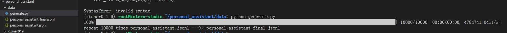
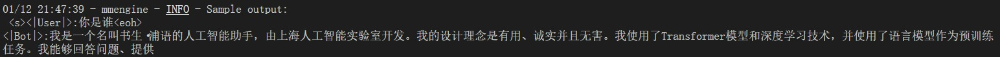

# 一、基础作业：

构建数据集，使用 XTuner 微调 InternLM-Chat-7B 模型, 让模型学习到它是你的智能小助手，效果如下图所示，本作业训练出来的模型的输出需要将不要葱姜蒜大佬替换成自己名字或昵称！


## 训练
1. 数据准备
   1. `mkdir -p /root/personal_assistant/data && cd /root/personal_assistant/data`
   2. 数据样例
```json
# personal_assistant.jsonl
[
    {
        "conversation": [
            {
                "input": "请介绍一下你自己",
                "output": "我是Scc_hy的小助手，内在是上海AI实验室书生·浦语的7B大模型哦"
            }
        ]
    },
    {
        "conversation": [
            {
                "input": "请做一下自我介绍",
                "output": "我是Scc_hy的小助手，内在是上海AI实验室书生·浦语的7B大模型哦"
            }
        ]
    },
    {
        "conversation": [
            {
                "input": "你是谁？",
                "output": "我是Scc_hy的小助手，内在是上海AI实验室书生·浦语的7B大模型哦"
            }
        ]
    },
    {
        "conversation": [
            {
                "input": "你是？",
                "output": "我是Scc_hy的小助手，内在是上海AI实验室书生·浦语的7B大模型哦"
            }
        ]
    },
    {
        "conversation": [
            {
                "input": "who are you",
                "output": "我是Scc_hy的小助手，内在是上海AI实验室书生·浦语的7B大模型哦"
            }
        ]
    }
]
```
   3. 生成更多样本 `pip install tqdm`
```python
import json
from tqdm.auto import tqdm


def g_json(file, out_file,  n=1000):
    with open(file, 'r') as f:
        res = json.load(f)
    
    res_final = []
    for _ in tqdm(range(n), total=n):
        res_final.extend(res)

    with open(out_file, 'w', encoding='utf-8') as f:
        json.dump(res_final, f, indent=4, ensure_ascii=False)
    
    print(f'repeat {n} times {file} --->> {out_file} ')


if __name__ == '__main__':
    file = 'personal_assistant.jsonl'
    out_file = 'personal_assistant_final.jsonl'
    g_json(file, out_file,  n=1000)
```


2. 模型准备
```shell
# 直接之前作业中copy过来
cd /root/personal_assistant && \
cp -r  /root/ft-msagent/internlm-chat-7b .
```
3. 模型配置 (下载 -> 修改参数)
```shell
xtuner copy-cfg internlm_chat_7b_qlora_oasst1_e3 .
```
4. 模型微调 `xtuner train internlm_chat_7b_qlora_oasst1_e3_copy.py --deepspeed deepspeed_zero2`
5. 转hf & 模型合并
```shell
# hf
# ----------------------------------
cd /root/personal_assistant
mkdir hf

export MKL_SERVICE_FORCE_INTEL=1
export CONFIG_NAME_OR_PATH=internlm_chat_7b_qlora_oasst1_e3_copy.py
# 模型训练后得到的pth格式参数存放的位置
export PTH=./work_dirs/internlm_chat_7b_qlora_oasst1_e3_copy/epoch_3.pth
export SAVE_PATH=./hf

# 执行参数转换
xtuner convert pth_to_hf $CONFIG_NAME_OR_PATH $PTH $SAVE_PATH

# merge 
# ----------------------------------
cd /root/personal_assistant
mkdir hf_merge

export MKL_SERVICE_FORCE_INTEL=1
export MKL_THREADING_LAYER='GNU'

# 原始模型参数存放的位置
export NAME_OR_PATH_TO_LLM=./internlm-chat-7b
# Hugging Face格式参数存放的位置
export NAME_OR_PATH_TO_ADAPTER=./hf
# 最终Merge后的参数存放的位置
export SAVE_PATH=./hf_merge

# 执行参数Merge
xtuner convert merge \
    $NAME_OR_PATH_TO_LLM \
    $NAME_OR_PATH_TO_ADAPTER \
    $SAVE_PATH \
    --max-shard-size 2GB
```

微调前（回答比较官方）


微调后（对自己的身份有了清晰的认知）


## 网页Demo


# 进阶作业：

1. 将训练好的Adapter模型权重上传到 OpenXLab、Hugging Face 或者 MoelScope 任一一平台。
```python
import openxlab

```
2. 将训练好后的模型应用部署到 OpenXLab 平台


