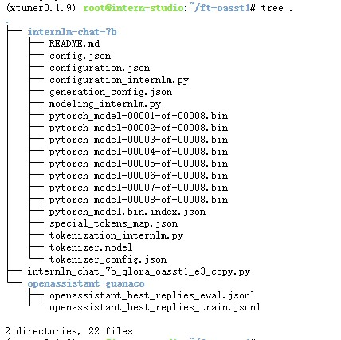
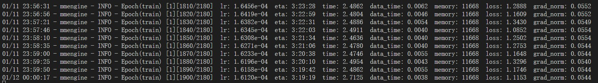
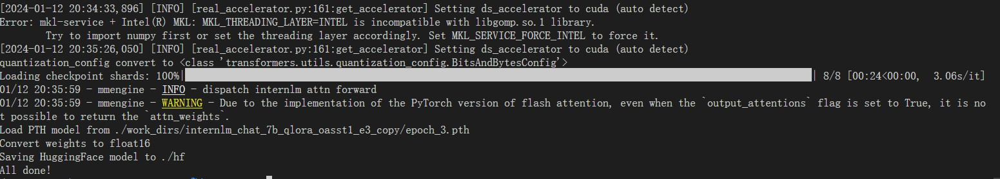
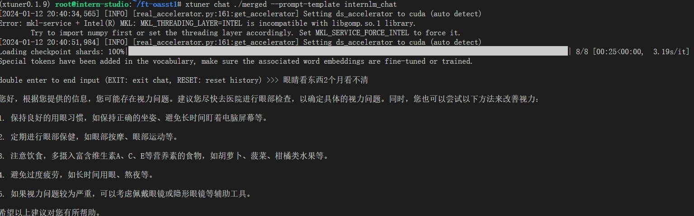
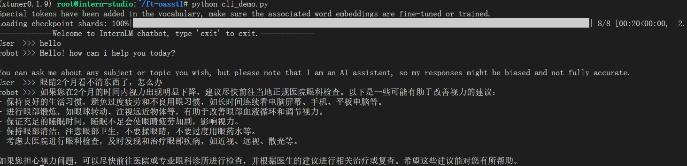
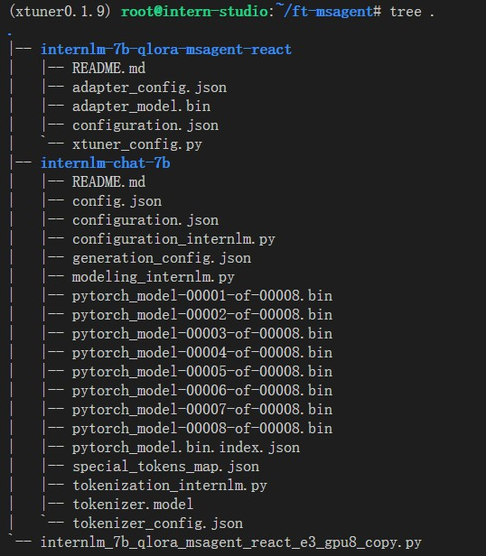
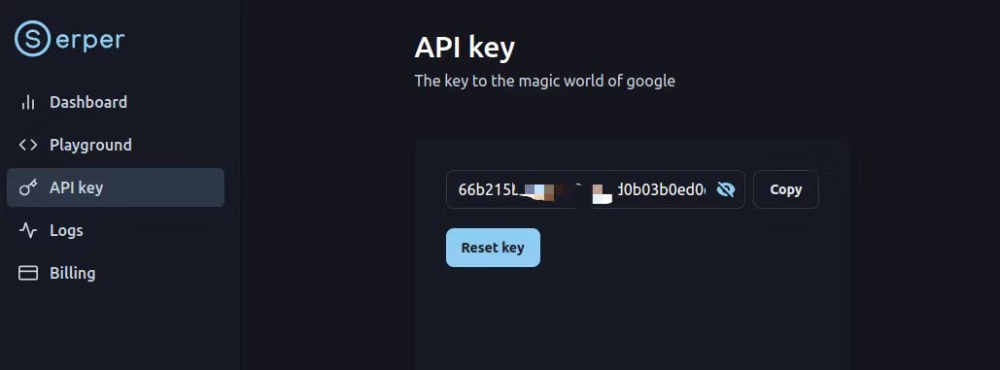
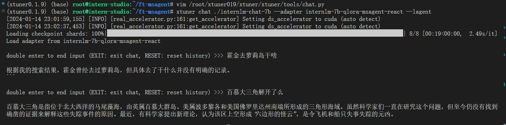
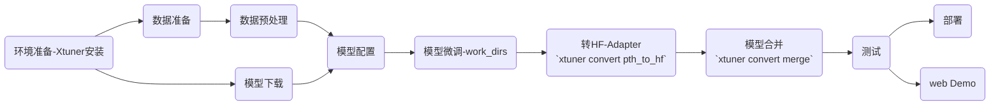

# 1 快速上手
## 1.1 平台

Ubuntu + Anaconda + CUDA/CUDNN + 8GB nvidia显卡  (当前用的A100 1/4 * 2 40G)


## 1.2 微调

1. 安装`xtuner`

```shell
# 激活环境
conda activate xtuner0.1.9

cd ~
mkdir xtuner019 && cd xtuner019

git clone -b v0.1.9  https://github.com/InternLM/xtuner
# 无法访问github的用户请从 gitee 拉取:
# git clone -b v0.1.9 https://gitee.com/Internlm/xtuner

# 从源码安装 XTuner
cd xtuner
pip install -e '.[all]'

# 创建一个微调 oasst1 数据集的工作路径，进入
mkdir ~/ft-oasst1 && cd ~/ft-oasst1
```

2. 模型下载
```shell
mkdir ~/ft-oasst1/internlm-chat-7b
pip install modelscope
cd ~/ft-oasst1
apt install git git-lfs -y
git lfs install
git lfs clone https://modelscope.cn/Shanghai_AI_Laboratory/internlm-chat-7b.git -b v1.0.3
```
3. 数据下载
[https://huggingface.co/datasets/timdettmers/openassistant-guanaco/tree/main](https://huggingface.co/datasets/timdettmers/openassistant-guanaco/tree/main)
```shell
cd ~/ft-oasst1
# ...-guanaco 后面有个空格和英文句号啊
cp -r /root/share/temp/datasets/openassistant-guanaco .
```


4. 开始微调

```shell
# 单卡
nohup xtuner train ./internlm_chat_7b_qlora_oasst1_e3_copy.py > __xtuner.log &
# 观察日志
tail -f __xtuner.log
```


5. 将得到的 PTH 模型转换为 HuggingFace 模型，即：生成 Adapter 文件夹
```shell
mkdir hf
export MKL_SERVICE_FORCE_INTEL=1

xtuner convert pth_to_hf ./internlm_chat_7b_qlora_oasst1_e3_copy.py ./work_dirs/internlm_chat_7b_qlora_oasst1_e3_copy/epoch_3.pth ./hf
```


## 1.3 部署与测试

1. 将 HuggingFace adapter 合并到大语言模型：
```shell
xtuner convert merge ./internlm-chat-7b ./hf ./merged --max-shard-size 2GB
# xtuner convert merge \
#     ${NAME_OR_PATH_TO_LLM} \
#     ${NAME_OR_PATH_TO_ADAPTER} \
#     ${SAVE_PATH} \
#     --max-shard-size 2GB
```

2. 与合并后的模型对话
```shell
# 加载 Adapter 模型对话（Float 16）
xtuner chat ./merged --prompt-template internlm_chat

# 4 bit 量化加载
# xtuner chat ./merged --bits 4 --prompt-template internlm_chat
```
|启动参数 | 干哈滴|
|-|-|
--prompt-template | 指定对话模板
--system | 指定SYSTEM文本
--system-template | 指定SYSTEM模板
--bits | LLM位数
--bot-name | bot名称
--with-plugins | 指定要使用的插件
--no-streamer | 是否启用流式传输
--lagent | 是否使用lagent
--command-stop-word | 命令停止词
--answer-stop-word | 回答停止词
--offload-folder | 存放模型权重的文件夹（或者已经卸载模型权重的文件夹）
--max-new-tokens | 生成文本中允许的最大 token 数量
--temperature | 温度值
--top-k | 保留用于顶k筛选的最高概率词汇标记数
--top-p | 如果设置为小于1的浮点数，仅保留概率相加高于 top_p 的最小一组最有可能的标记
--seed | 用于可重现文本生成的随机种子



3.  Demo
修改 `cli_demo.py` 中的模型路径
```python
- model_name_or_path = "/root/model/Shanghai_AI_Laboratory/internlm-chat-7b"
+ model_name_or_path = "merged"

python ./cli_demo.py
```


# 2. 自定义微调

> 基于 InternLM-chat-7B 模型，用 MedQA 数据集进行微调，将其往医学问答领域对齐。

## 2.1 数据预处理

> 将数据转为 XTuner 的数据格式

数据下载
```shell
mkdir ft-medqa
~/ft-medqa
git clone https://github.com/abachaa/Medication_QA_MedInfo2019
cd Medication_QA_MedInfo2019 && \
mv MedInfo2019-QA-Medications.xlsx ../ && \
cd ..

pip install openpyxl
```
数据处理 & 拆分
```python
res = """
[{
    "conversation":[
        {
            "system": "xxx",
            "input": "xxx",
            "output": "xxx"
        }
    ]
},
{
    "conversation":[
        {
            "system": "xxx",
            "input": "xxx",
            "output": "xxx"
        }
    ]
}]
""" 

# dataPrepare.py
import pandas as pd 
from tqdm.auto import tqdm
import json 
import random


def xlsx2json(file, output_file):
    df = pd.read_excel(file)
    # Answer数据中存在NA
    df = df[~df.Answer.isna()].reset_index(drop=True)
    need_cols = ['system', 'Question', 'Answer']
    df['system'] = "You are a professional, highly experienced doctor professor. You always provide accurate, comprehensive, and detailed answers based on the patients' questions."
    final_res = []
    for idx, row in tqdm(df[need_cols].rename(
            columns=dict(zip(need_cols[1:], ['input', 'output']))
        ).iterrows(), total=df.shape[0]):
        final_res.append({"conversation":[row.T.to_dict()]})
    with open(output_file, 'w', encoding='utf-8') as f:
        json.dump(final_res, f, indent=4)
    print(f"Conversion complete. Output written to {output_file}")
    print(final_res[0])


def split_train_test(file, out_train_file, out_test_file):
    with open(file, 'r', encoding='utf-8') as f:
        data = json.load(f)
    data_len = len(data)    
    random.shuffle(data)
    split_point = int(data_len * 0.7)
    # Split the data into train and test
    train_data = data[:split_point]
    test_data = data[split_point:]
    with open(out_train_file, 'w', encoding='utf-8') as f:
        json.dump(train_data, f, indent=4)
    with open(out_test_file, 'w', encoding='utf-8') as f:
        json.dump(test_data, f, indent=4)
    print(f"Split complete. Train data written to {out_train_file}, Test data written to {out_test_file}")


if __name__ == '__main__':
    file = 'MedInfo2019-QA-Medications.xlsx'
    xlsx2json(file, 'output.jsonl')
    split_train_test('output.jsonl', 'MedQA2019-structured-train.jsonl', 'MedQA2019-structured-test.jsonl')

```

## 2.2 开始自定义微调

1. 新建文件 copy数据
```shell
mkdir ~/ft-medqa && cd ~/ft-medqa && \
cp -r ~/ft-oasst1/internlm-chat-7b .
# 复制文件
cp ~/ft-oasst1/MedQA2019-structured-t* ~/ft-medqa
```
2. 训练文档准备
```shell
# 复制配置文件到当前目录
xtuner copy-cfg internlm_chat_7b_qlora_oasst1_e3 .
# 改个文件名
mv internlm_chat_7b_qlora_oasst1_e3_copy.py internlm_chat_7b_qlora_medqa2019_e3.py

# 修改配置文件内容
vim internlm_chat_7b_qlora_medqa2019_e3.py
```
3. 开始微调
```shell
nohup xtuner train internlm_chat_7b_qlora_medqa2019_e3.py > __xtuner.log &
nohup xtuner train internlm_chat_7b_qlora_medqa2019_e3.py --deepspeed deepspeed_zero2 > __ds_xtuner.log &

```
1. 生成 Adapter 文件夹
2. 合并到大语言模型
3. 对话测试
```shell
mkdir hf
export MKL_SERVICE_FORCE_INTEL=1

# Adapter
xtuner convert pth_to_hf ./internlm_chat_7b_qlora_medqa2019_e3.py ./work_dirs/internlm_chat_7b_qlora_medqa2019_e3/epoch_3.pth ./hf
# merge
xtuner convert merge ./internlm-chat-7b ./hf ./merged --max-shard-size 2GB
# test
xtuner chat ./merged --prompt-template internlm_chat
# what would a normal dose be for valacyclovir
res="
double enter to end input (EXIT: exit chat, RESET: reset history) >>> what would a normal dose be for valacyclovir

The normal dose of valacyclovir for the treatment of herpes simplex virus (HSV) infections is 1 gram taken orally twice a day for 7-10 days. However, the dose may vary depending on the severity of the infection and the individual's medical history. It is important to consult with a healthcare provider to determine the appropriate dose for your specific situation.<eoa>

double enter to end input (EXIT: exit chat, RESET: reset history) >>> tylenol pm mg


Tylenol PM is a medication that contains acetaminophen and diphenhydramine, which are both used to treat pain and reduce fever. The recommended dose of Tylenol PM is 2 tablets every 4-6 hours as needed for pain and 2-4 tablets every 4-6 hours as needed for fever. It is important to follow the recommended dose and not exceed the maximum daily dose of 4000 mg of acetaminophen, as this can lead to liver damage. It is also important to consult with a healthcare provider before taking any medication, especially if you have any underlying medical conditions or are taking other medications.<eoa
"
```


# 3 【补充】用 MS-Agent 数据集 赋予 LLM 以 Agent 能力


MSAgent 数据集每条样本包含一个对话列表（conversations），其里面包含了 system、user、assistant 三种字段。其中：
- system: 表示给模型前置的人设输入，其中有告诉模型如何调用插件以及生成请求
- user: 表示用户的输入 prompt，分为两种，通用生成的prompt和调用插件需求的 prompt
- assistant: 为模型的回复。其中会包括插件调用代码和执行代码，调用代码是要 LLM 生成的，而执行代码是调用服务来生成结果的

1. 文件及数据准备
```shell
mkdir ~/ft-msagent && cd ~/ft-msagent
cp -r ~/ft-oasst1/internlm-chat-7b .

# 查看配置文件
xtuner list-cfg | grep msagent

# 复制配置文件到当前目录
xtuner copy-cfg internlm_7b_qlora_msagent_react_e3_gpu8 .

# 修改配置文件中的模型为本地路径
vim ./internlm_7b_qlora_msagent_react_e3_gpu8_copy.py 
```
2. 开始微调 `xtuner train ./internlm_7b_qlora_msagent_react_e3_gpu8_copy.py --deepspeed deepspeed_zero2`
3. 使用已经训练好模型
   1. 有了这个在 msagent 上训练得到的Adapter，模型现在已经有 agent 能力了！就可以加 `--lagent` 以调用来自 lagent 的代理功能了
```shell
cd ~/ft-msagent
apt install git git-lfs
git lfs install
git lfs clone https://www.modelscope.cn/xtuner/internlm-7b-qlora-msagent-react.git
```
  
4. 添加 serper 环境变量 
   1. `export SERPER_API_KEY=66b215b8866de8c0cbd0b03b0ed0cbaa4f684f13`   这部分的注册是需要科学上网
   2. `export MKL_SERVICE_FORCE_INTEL=1`
   3. `export MKL_THREADING_LAYER='GNU'`
   4. `pip install tritonclient`
   5. `pip install grpcio`
   6. `pip install grpcio-tools googleapis-common-protos`
   7. `vim /root/xtuner019/xtuner/xtuner/tools/chat.py`

1. 启动  
   1. `xtuner chat ./internlm-chat-7b --adapter internlm-7b-qlora-msagent-react --lagent`



# 4- 小结

微调的主要流程如下


注：
- 配置：`xtuner copy-cfg internlm_chat_7b_qlora_oasst1_e3 .`
- 微调：`xtuner train internlm_chat_7b_qlora_oasst1_e3_copy.py --deepspeed deepspeed_zero2`
- 测试: `xtuner chat ./hf_merge --prompt-template internlm_chat`
- 转Adaoter & merge:
```shell
# hf
# ----------------------------------
mkdir hf
export MKL_SERVICE_FORCE_INTEL=1
export CONFIG_NAME_OR_PATH=internlm_chat_7b_qlora_oasst1_e3_copy.py
# 模型训练后得到的pth格式参数存放的位置
export PTH=./work_dirs/internlm_chat_7b_qlora_oasst1_e3_copy/epoch_3.pth
export SAVE_PATH=./hf
# 执行参数转换
xtuner convert pth_to_hf $CONFIG_NAME_OR_PATH $PTH $SAVE_PATH

# merge 
# ----------------------------------
mkdir hf_merge
export MKL_SERVICE_FORCE_INTEL=1
export MKL_THREADING_LAYER='GNU'
# 原始模型参数存放的位置
export NAME_OR_PATH_TO_LLM=./internlm-chat-7b
# Hugging Face格式参数存放的位置
export NAME_OR_PATH_TO_ADAPTER=./hf
# 最终Merge后的参数存放的位置
export SAVE_PATH=./hf_merge
# 执行参数Merge
xtuner convert merge \
    $NAME_OR_PATH_TO_LLM \
    $NAME_OR_PATH_TO_ADAPTER \
    $SAVE_PATH \
    --max-shard-size 2GB
```

