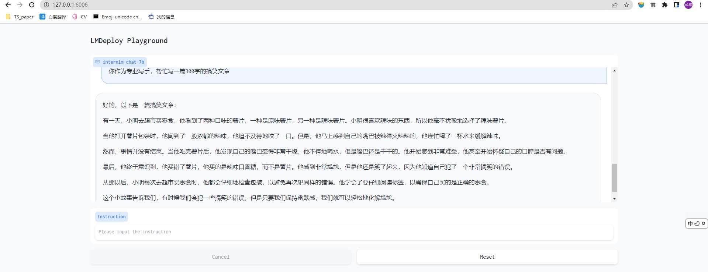
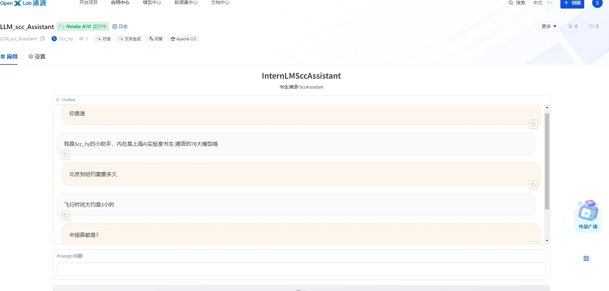
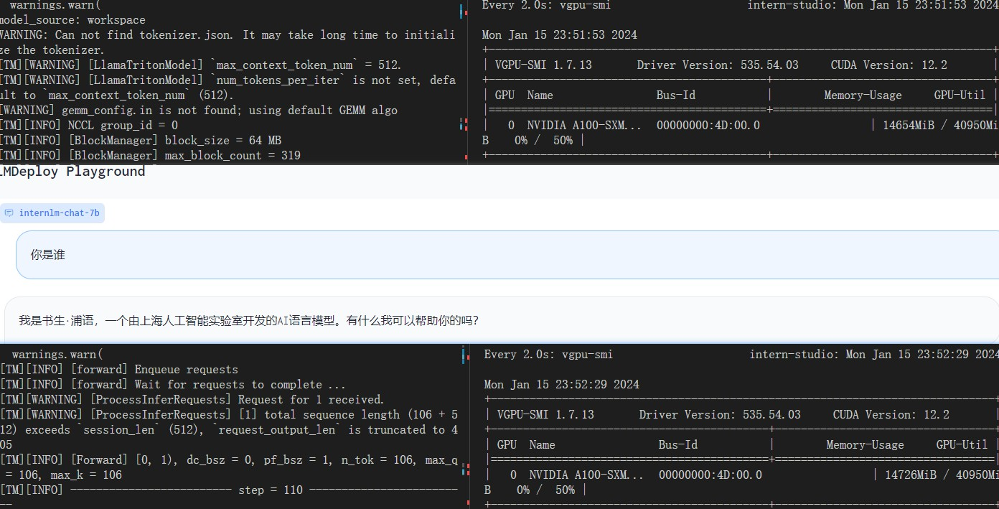
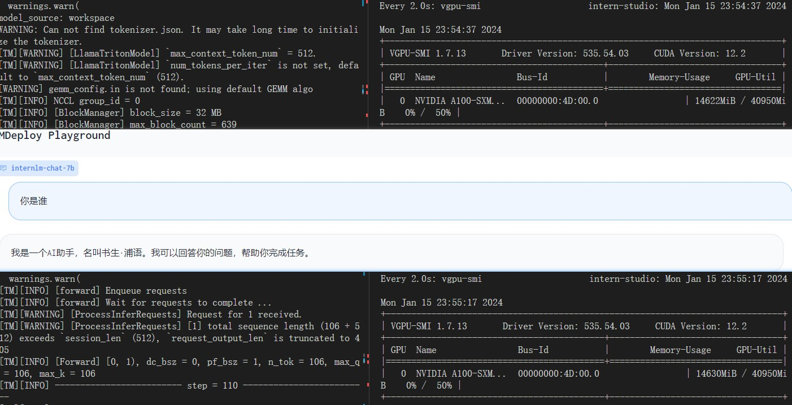
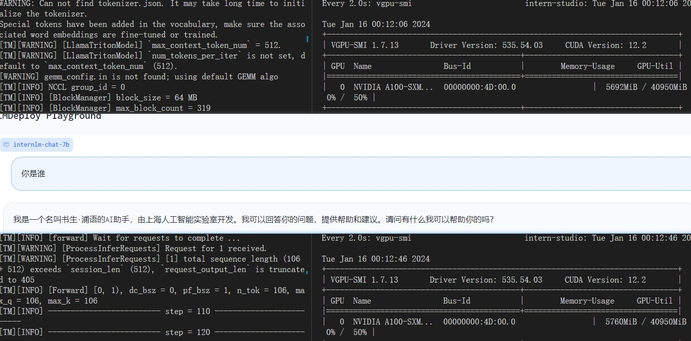
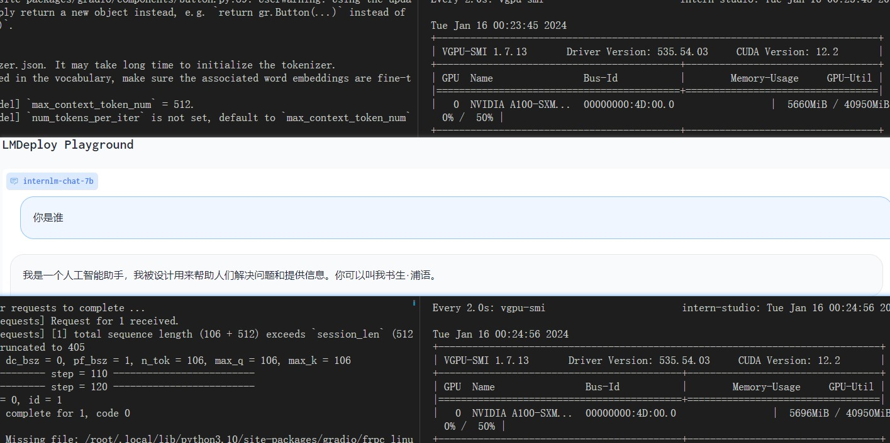
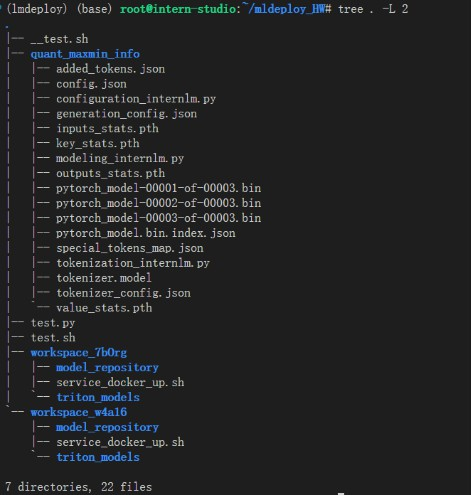
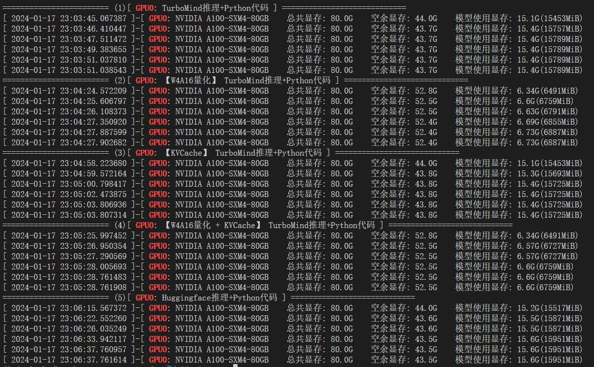
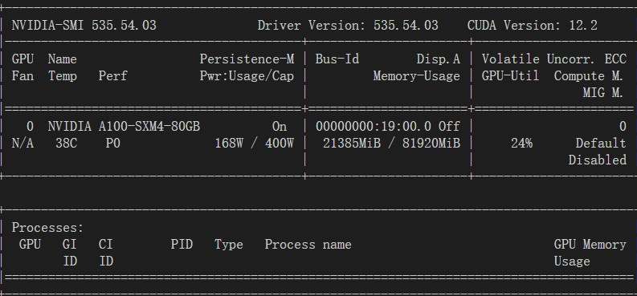

# 一、基础作业

> 使用 LMDeploy 以本地对话、网页Gradio、API服务中的一种方式部署 InternLM-Chat-7B 模型，生成 300 字的小故事（需截图）




# 二、进阶作业 

## 2.1 自我认知小助手模型量化部署
将第四节课训练自我认知小助手模型使用 LMDeploy 量化部署到 OpenXLab 平台。  
在第四节中已经将Xtun微调的参数转成adapter，并和原来的模型进行合并。
- 因为过拟合所以将造的数据和MedQA2019数据进行混合，再微调-最终解决过拟合问题
  - 产出文件模型文件在：`/root/personal_assistant/hf_merge`
- 进行基本量化流程
  - 统计maxmin
  - 模型量化
  - 模型转换
  - 模型上传到 `modelscope`
- 模型部署
  - 部署github: [LLM_W4A16_myAssistant](https://github.com/scchy/LLM_W4A16_myAssistant)
  - 部署应用openxlab地址 [https://openxlab.org.cn/apps/detail/Scchy/LLM_scc_Assistant](https://openxlab.org.cn/apps/detail/Scchy/LLM_scc_Assistant)




## 2.2 量化比对
对internlm-chat-7b <font color=darkred>模型进行量化，并同时使用KV Cache量化</font>，使用量化后的模型完成API服务的部署。
   - 分别对比模型量化前后和 KV Cache 量化前后的显存大小（将 bs设置为 1 和 max len 设置为512）。
```shell
# 0- 离线模型装换
lmdeploy convert internlm-chat-7b  \
    /root/share/temp/model_repos/internlm-chat-7b/ \
    --dst_path ./workspace_7bOrg

# 1. 计算 minmax
lmdeploy lite calibrate \
  --model  /root/share/temp/model_repos/internlm-chat-7b/ \
  --calib_dataset "c4" \
  --calib_samples 128 \
  --calib_seqlen 2048 \
  --work_dir ./quant_maxmin_info

# 2-1 KV Cache 量化
lmdeploy lite kv_qparams \
  --work_dir ./quant_maxmin_info  \
  --turbomind_dir workspace/triton_models/weights/ \
  --kv_sym False \
  --num_tp 1
# 修改配置 quant_policy=4


# 2-2 量化权重模型
lmdeploy lite auto_awq \
  --model  /root/share/temp/model_repos/internlm-chat-7b/ \
  --w_bits 4 \
  --w_group_size 128 \
  --work_dir ./quant_maxmin_info

# 2-2-F  转换模型的layout
lmdeploy convert  internlm-chat-7b ./quant_maxmin_info \
    --model-format awq \
    --group-size 128 \
    --dst_path ./workspace_w4a16


# 2-3 量化模型 + KV Cache
lmdeploy lite kv_qparams \
  --work_dir ./quant_maxmin_info  \
  --turbomind_dir ./workspace_w4a16/triton_models/weights/ \
  --kv_sym False \
  --num_tp 1
```
- [ ] 如何比对
  - [ ] 比对参数设置`xx_workspace/triton_models/weights/config.ini` :`max_batch_size = 1` 和 `session_len = 512` 和 `quant_policy=4 & 0`
  - [ ] 问题：你是谁
- [ ] 如何启动
  - [X] 启动原始的模型（离线转换后）`lmdeploy serve gradio ./workspace_7bOrg`
  - [X] kv量化后的模型可以直接在 workspace 启动 `lmdeploy serve gradio ./workspace`
  - [X] 量化后的模型可以直接在 对应workspace 启动 `lmdeploy serve gradio ./workspace_w4a16`
  - [X] 量化后的模型+KV可以直接在 对应workspace 启动 `lmdeploy serve gradio ./workspace_w4a16`


| 模型类型 | 配置 | 操作截图 |  模型大小&变化 |
|-|-|-|-|
| internlm-chat-7b | `max_batch_size = 1` 和 `session_len = 512` 和 `quant_policy=0` |  | 14654 MiB -> 14726 MiB (72 MiB)|
| internlm-chat-7b + KV Cache| `max_batch_size = 1` 和 `session_len = 512` 和 `quant_policy=4` | | 14622 MiB -> 14630iB (8 MiB)|
| internlm-chat-7b-Qunt| `max_batch_size = 1` 和 `session_len = 512` 和 `quant_policy=0` | | 5692 MiB -> 5760 MiB (68 MiB)| 
| internlm-chat-7b-Qunt + KV Cache | `max_batch_size = 1` 和 `session_len = 512` 和 `quant_policy=4` | | 5660 MiB -> 5696 MiB (36 MiB)   **因为推理用FP16所以会额外多占一些显存**| 


## 2.3 在任务数据集上进行测试比对

在自己的任务数据集上任取若干条进行Benchmark测试，测试方向包括：
> 整体的执行lmdeploy和上2.2基本一致  
> 测试总文件 [test.sh](./lmdeploy_HW/test.sh)  
> 总执行 `nohup sh test.sh > __test.sh &`  
> 文件夹:   
> 
> 

1. TurboMind推理+Python代码集成
   1. 见下列代码
   2. `python test.py '/root/share/temp/model_repos/internlm-chat-7b/'`
2. 在（1）的基础上采用W4A16量化
   1.  `lmdeploy convert internlm-chat-7b` -> `lmdeploy lite auto_awq ... --turbomind_dir ./workspace_7bOrg/triton_models/weights/`
   2. 修改`config.ini:  quant_policy = 4`
   3.  `python test.py '/root/mldeploy_HW/workspace_7bOrg/'`
3. 在（1）的基础上开启KV Cache量化
   1.  `lmdeploy lite calibrate` -> `lmdeploy lite kv_qparams`
4. 在（2）的基础上开启KV Cache量化
   1. 模型量化（2）已经进行`lmdeploy lite auto_awq` 量化
   2. 转换模型的layout `lmdeploy convert ... --dst_path ./workspace_w4a16`
   3. KV Cache量化 `lmdeploy lite kv_qparams ... --turbomind_dir ./workspace_w4a16/triton_models/weights/ `
   4. 修改`config.ini:  quant_policy = 4`
   5. `python test.py '/root/mldeploy_HW/workspace_w4a16/'`
5. 使用Huggingface推理

----
- 小结-详情看截图
  -  (1) 测试完的显存总增长是$15789-15453=336$  
  -  (2) 测试完的显存总增长是$6889-6491=398$ 同(1)相比仅仅进行了W4A16量化, 在推理过程中用FP16，所以显存增长会高于(1)
  -  (3) 测试完的显存总增长是$15725-15453=272$ 同(1)相比进行了KVCache量化，显存增长有显著的减少
  -  <font color=darkred>(4) 测试完的显存总增长是$6759-6491=268$ 同(1)(2)(3) 相比占显存和增长显存均是最低的 </font>
  -  (5) 测试完的显存总增长是$15951-15517=434$ 同(1)相比 Huggingface 推理更加占显存

----



也可查看文件 [test.py](./lmdeploy_HW/test.py)

注：
- 21385MiB 为开启的时候初始CUDA占用情况

```python
# test.py
from lmdeploy import turbomind as tm
from datetime import datetime 
from tqdm.auto import tqdm
import sys
from pynvml import (
    nvmlDeviceGetHandleByIndex, nvmlInit, nvmlDeviceGetMemoryInfo, 
    nvmlDeviceGetName,  nvmlShutdown
)
import torch
from transformers import AutoTokenizer, AutoModelForCausalLM


def cuda_mem():
    # 21385MiB / 81920MiB
    fill = 21385
    n = datetime.now()
    nvmlInit()
    # 创建句柄
    handle = nvmlDeviceGetHandleByIndex(0)
    # 获取信息
    info = nvmlDeviceGetMemoryInfo(handle)
    # 获取gpu名称
    gpu_name = nvmlDeviceGetName(handle)
    # 查看型号、显存、温度、电源
    print("[ {} ]-[ GPU{}: {}".format(n, 0, gpu_name), end="    ")
    print("总共显存: {:.3}G".format((info.total // 1048576) / 1024), end="    ")
    print("空余显存: {:.3}G".format((info.free // 1048576) / 1024), end="    ")
    model_use = (info.used  // 1048576) - fill
    print("模型使用显存: {:.3}G({}MiB)".format( model_use / 1024, model_use))
    nvmlShutdown()


def tm_chat(model, query):
    generator = model.create_instance()
    # process query
    # query = "你是谁"
    prompt = model.model.get_prompt(query)
    input_ids = model.tokenizer.encode(prompt)
    # inference
    for outputs in generator.stream_infer(
            session_id=0,
            input_ids=[input_ids]):
        res, tokens = outputs[0]

    response = model.tokenizer.decode(res.tolist())
    return response


def hf_model(query_list):
    model_name_or_path = "/root/share/temp/model_repos/internlm-chat-7b/"
    tokenizer = AutoTokenizer.from_pretrained(model_name_or_path, trust_remote_code=True)
    model = AutoModelForCausalLM.from_pretrained(model_name_or_path, trust_remote_code=True, torch_dtype=torch.bfloat16, device_map='auto')
    model = model.eval()
    cuda_mem()
    for q in tqdm(query_list):
        res = model.chat(tokenizer, q)
        print(f'res={res}')
        cuda_mem()
    print('**'*25)
    cuda_mem()


def main():
    print('**'*25)
    q_list = [
         '你是谁？',
        'what is the dose for vit b12 tabet?',
        'how long do opioid withdraws last',
        'why did my doctor give me levetiracetam'
    ]
    model_path = sys.argv[1]
    if model_path == 'HF':
        hf_model(q_list)
        return None
    tm_model = tm.TurboMind.from_pretrained(model_path, model_name='internlm-chat-7b')
    cuda_mem()
    for q in tqdm(q_list):
        res = tm_chat(tm_model, q)
        print(f'res={res}')
        cuda_mem()
    print('**'*25)
    cuda_mem()


if __name__ == '__main__':
    main()
```

