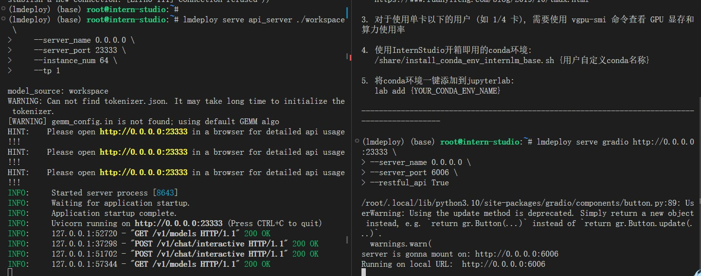

- [参考： 仅需一块3090显卡，高效部署InternLM-20B模型](https://zhuanlan.zhihu.com/p/665725861)
- reference: [https://github.com/InternLM/tutorial/blob/main/lmdeploy/lmdeploy.md](https://github.com/InternLM/tutorial/blob/main/lmdeploy/lmdeploy.md)

# 1- 环境准备
```shell
conda create -n CONDA_ENV_NAME --clone /share/conda_envs/internlm-base

conda activate lmdeploy

# 使用 flash_attn 的预编译包解决安装过慢问题
pip install packaging
pip install /root/share/wheels/flash_attn-2.4.2+cu118torch2.0cxx11abiTRUE-cp310-cp310-linux_x86_64.whl
pip install 'lmdeploy[all]==v0.1.0'
```


# 2- 服务部署

- 模型推理/服务。主要提供模型本身的推理，一般来说可以和具体业务解耦，专注模型推理本身性能的优化。可以以模块、API等多种方式提供。
- Client。可以理解为前端，与用户交互的地方。
- API Server。一般作为前端的后端，提供与产品和服务相关的数据和功能支持。

## 2.1  模型转换

使用 TurboMind 推理模型需要先将模型转化为 TurboMind 的格式，目前支持在线转换和离线转换两种形式。在线转换可以直接加载 Huggingface 模型，离线转换需需要先保存模型再加载。

TurboMind 是一款关于 LLM 推理的高效推理引擎，基于英伟达的 FasterTransformer 研发而成。它的主要功能包括：LLaMa 结构模型的支持，persistent batch 推理模式和可扩展的 KV 缓存管理器。

1. 在线转换
   1. lmdeploy 支持直接读取 Huggingface 模型权重，目前共支持三种类型
```shell
export HF_ENDPOINT=https://hf-mirror.com
# 需要能访问 Huggingface 的网络环境
lmdeploy chat turbomind internlm/internlm-chat-20b-4bit --model-name internlm-chat-20b
lmdeploy chat turbomind Qwen/Qwen-7B-Chat --model-name qwen-7b

# 直接启动本地的 Huggingface 模型，如下所示
lmdeploy chat turbomind /share/temp/model_repos/internlm-chat-7b/  --model-name internlm-chat-7b
```
2. 离线转换
   - 离线转换需要在启动服务之前，将模型转为 lmdeploy TurboMind 的格式
```shell
# 转换模型（FastTransformer格式） TurboMind
lmdeploy convert internlm-chat-7b /path/to/internlm-chat-7b
lmdeploy convert internlm-chat-7b  /root/share/temp/model_repos/internlm-chat-7b/

apt-get install tree
tree ./workspace
```
  
   - 每一份参数第一个 0 表示“层”的索引，后面的那个0表示 Tensor 并行的索引，因为我们只有一张卡，所以被拆分成 1 份。如果有两张卡可以用来推理，则会生成0和1两份，也就是说，会把同一个参数拆成两份。比如 `layers.0.attention.w_qkv.0.weight` 会变成 `layers.0.attention.w_qkv.0.weight` 和 `layers.0.attention.w_qkv.1.weight`。执行 `lmdeploy convert` 命令时，可以通过 --tp 指定（tp 表示 tensor parallel），该参数默认值为1（也就是一张卡）。
   - 关于并行:简单来说，就是把一个大的张量（参数）分到多张卡上，分别计算各部分的结果，然后再同步汇总。 

## 2.2 模型推理(推理+命令行本地对话 & 推理+API服务)

1. `TurboMind` 推理+命令行本地对话
   - 这里支持多种方式运行，比如`Turbomind`、PyTorch、DeepSpeed。但 PyTorch 和 DeepSpeed 调用的其实都是 Huggingface 的 Transformers 包，PyTorch表示原生的 Transformer 包，DeepSpeed 表示使用了 DeepSpeed 作为推理框架。Pytorch/DeepSpeed 目前功能都比较弱，不具备生产能力，不推荐使用。
```shell
# Turbomind + Bash Local Chat
lmdeploy chat turbomind ./workspace

```

2. TurboMind推理+API服务
```shell
# ApiServer+Turbomind   api_server => AsyncEngine => TurboMind
# instance_num: batch size
# tp: 表示 Tensor 并行
lmdeploy serve api_server ./workspace \
    --server_name 0.0.0.0 \
    --server_port 23333 \
    --instance_num 64 \
    --tp 1

# 1- 服务器-新窗口
lmdeploy serve api_client http://localhost:23333
```

```shell
# 2- windows-shell 上打开
ssh -CNg -L 23333:127.0.0.1:23333 root@ssh.intern-ai.org.cn -p 34094
```


## 2.3 网页 Demo 演示

1- `必须先开启 Server`

```shell
# Gradio+ApiServer。必须先开启 Server，此时 Gradio 为 Client
lmdeploy serve gradio http://0.0.0.0:23333 \
--server_name 0.0.0.0 \
--server_port 6006 \
--restful_api True


ssh -CNg -L 6006:127.0.0.1:6006 root@ssh.intern-ai.org.cn -p 34094
```


2- `Gradio` 直接和 `TurboMind` 连接
```shell
# Gradio+Turbomind(local)
lmdeploy serve gradio ./workspace
```


## 2.4 TurboMind 推理 + Python 代码集成

```python
from lmdeploy import turbomind as tm

# load model
model_path = "/root/share/temp/model_repos/internlm-chat-7b/"
tm_model = tm.TurboMind.from_pretrained(model_path, model_name='internlm-chat-20b')
generator = tm_model.create_instance()

# process query
query = "你好啊兄嘚"
prompt = tm_model.model.get_prompt(query)
input_ids = tm_model.tokenizer.encode(prompt)

# inference
for outputs in generator.stream_infer(
        session_id=0,
        input_ids=[input_ids]):
    res, tokens = outputs[0]

response = tm_model.tokenizer.decode(res.tolist())
print(response)
```


## 2.5 最佳实践

> BatchSize=64时，TurboMind 的吞吐量超过 2000 token/s，整体比 DeepSpeed 提升约 5% - 15%

### 模型配置实践

```shell
[llama]
#  1- 模型属性相关的参数不可更改
model_name = internlm-chat-7b
head_num = 32
kv_head_num = 32
vocab_size = 103168
num_layer = 32
inter_size = 11008
norm_eps = 1e-06
attn_bias = 0
start_id = 1
end_id = 2
rotary_embedding = 128
rope_theta = 10000.0
size_per_head = 128
#  2- 数据类型相关的参数也不可更改
weight_type = fp16 # 目前支持 fp16 和 int4
group_size = 0 # weight_type 4bit 权重时，group_size 表示 awq 量化权重时使用的 group 大小
# 3- 可调整参数 - 一般情况下也不需要对其进行调整
tensor_para_size = 1
session_len = 2056
max_batch_size = 64
max_context_token_num = 1
step_length = 1
cache_max_entry_count = 0.5
cache_block_seq_len = 128
cache_chunk_size = 1
use_context_fmha = 1
quant_policy = 0
max_position_embeddings = 2048
rope_scaling_factor = 0.0
use_logn_attn = 0
```
- KV int8 开关：
    - 对应参数为 `quant_policy`，默认值为 0，表示不使用 KV Cache，如果需要开启，则将该参数设置为 4。
    - KV Cache 是对序列生成过程中的 K 和 V 进行量化，用以节省显存。我们下一部分会介绍具体的量化过程。
    - 当显存不足，或序列比较长时，建议打开此开关。
- 外推能力开关：
    - 对应参数为 `rope_scaling_factor` ，默认值为 0.0，表示不具备外推能力，设置为 1.0，可以开启 RoPE 的 Dynamic NTK 功能，支持长文本推理。另外，`use_logn_attn` 参数表示 Attention 缩放，默认值为 0，如果要开启，可以将其改为 1。
    - 外推能力是指推理时上下文的长度超过训练时的最大长度时模型生成的能力。如果没有外推能力，当推理时上下文长度超过训练时的最大长度，效果会急剧下降。相反，则下降不那么明显，当然如果超出太多，效果也会下降的厉害。
    - 当推理文本非常长（明显超过了训练时的最大长度）时，建议开启外推能力。
- 批处理大小：
    - 对应参数为 `max_batch_size`，默认为 64，也就是我们在 API Server 启动时的 instance_num 参数。
    - 该参数值越大，吞度量越大（同时接受的请求数），但也会占用更多显存。
    - 建议根据请求量和最大的上下文长度，按实际情况调整。


# 3- 模型量化

> 常见的 LLM 模型由于 Decoder Only 架构的特性，实际推理时大多数的时间都消耗在了逐 Token 生成阶段（Decoding 阶段），是典型的访存密集型场景。

优化 LLM 模型推理中的访存密集问题:
- KV Cache 量化
- 4bit Weight Only 量化（W4A16）
  - Weight Only 是指仅量化权重，数值计算依然采用 FP16（需要将 INT4 权重反量化）。


## 3.1 KV Cache 量化

### KV Cache 提速的原因

Decoder 推理时，最大的不同在于**自回归结构**，从图中我们可以看出每个timestep的输出都是下一个timestep的输入，所以无法像Encoder一样一口气过，每次都要 attend 之前的所有的 timestep。 

计算开销$1+(1+2)+(1+2+3)+...+(1+2+..+n)$也就是$O(N^3)$,而内存开销则是$O(N^2)$


Decoder  每次前向，当前 timestep 计算 Attention 要用到的部分，如之前 timestep 的 KV （Key 和 Value）值都计算过的，只是之前每次前向完后给计算结果都丢掉，只保留最后输出。

于是一个很自然的想法就是 Cache。这很像斐波那契递归函数，naive 版本，也会出现不断重复计算问题，加个 cache 瞬间提速。
每次前向完，给 KV 都保留下来，用于之后计算。

```python
# q、k、v 当前 timestep 的 query，key，value
# K_prev,V_prev 之前所有 timestep 的 key 和 value
for _ in range(time_step):
    ...
    K = torch.cat([K_prev, k], dim=-2) #[b, h, n, d]
    V = torch.cat([V_prev, v], dim=-2) #[b, h, n, d]

    logits = torch.einsum("bhd,bhnd->bhn", q, K)
    weights = torch.softmax(logits/math.sqrt(d), dim=-1)
    outs = torch.einsum("bhn,bhnd->bhd", weights, V)
    ...
    
    K_prev, V_prev = K, V
```
<font color=darkred>于是 Decoder 就被优化成，计算开销变成了$O(N^2)$，存储复杂度则是$O(N)$，只给 K 和 V 不断保存在缓存中就行。问题解决了！</font>

### KV Cache 显存计算
从上面的代码我们就可以非常轻松的计算出

KV-cache占的显存：

**Cache_ele** = 2 * (batch_size * num_head * sequen_len * head_dim) * num_layer  
**Cache_mem** = Cache_ele * dataType-size / 1024**3 GB

- KVQ维度`[b, h, n, d]`: batch_size * num_head * sequen_len * head_dim
- q维度`[b, h, d]`: batch_size * num_head * head_dim


### KV Cache 量化步骤

1. 计算 minmax。主要思路是通过计算给定输入样本在每一层不同位置处计算结果的统计情况。
   - 对于 Attention 的 K 和 V：取每个 Head 各自维度在所有Token的最大、最小和绝对值最大值。对每一层来说，上面三组值都是 (num_heads, head_dim) 的矩阵。这里的统计结果将用于本小节的 KV Cache。
   - 对于模型每层的输入：取对应维度的最大、最小、均值、绝对值最大和绝对值均值。每一层每个位置的输入都有对应的统计值，它们大多是 (hidden_dim, ) 的一维向量，当然在 FFN 层由于结构是先变宽后恢复，因此恢复的位置维度并不相同。这里的统计结果用于下个小节的模型参数量化，主要用在缩放环节（回顾PPT内容）。
```shell
# 计算 minmax
# 会选择 128 条输入样本，每条样本长度为 2048，数据集选择 C4
lmdeploy lite calibrate \
  --model  /root/share/temp/model_repos/internlm-chat-7b/ \
  --calib_dataset "c4" \
  --calib_samples 128 \
  --calib_seqlen 2048 \
  --work_dir ./quant_output 

# 实际是分两步进行的 
# 1- calib_dataloader.py 到安装目录替换该文件 [lmdeploy pip 安装路径不大一样]
cp /root/share/temp/datasets/c4/calib_dataloader.py /root/.local/lib/python3.10/site-packages/lmdeploy/lite/utils/
# 2- 数据集（c4）复制到下面的目录：
cp -r /root/share/temp/datasets/c4/ /root/.cache/huggingface/datasets/
```
2. 通过 minmax 获取量化参数。主要就是利用下面这个公式，获取每一层的 K V 中心值（zp）和缩放值（scale）
```python
zp = (min+max) / 2
scale = (max-min) / 255
quant: q = round( (f-zp) / scale)
dequant: f = q * scale + zp
```
   - 执行命令 
```shell
# 通过 minmax 获取量化参数
lmdeploy lite kv_qparams \
  --work_dir ./quant_output  \
  --turbomind_dir workspace/triton_models/weights/ \
  --kv_sym False \
  --num_tp 1

```
- `num_tp` ：表示 Tensor 的并行数。
- 每一层的中心值和缩放值会存储到 workspace 的参数目录中以便后续使用。
- `kv_sym` 为 True 时会使用另一种（对称）量化方法，它用到了第一步存储的绝对值最大值，而不是最大值和最小值。

3. 修改配置。`weights/config.ini 文件`
   1. `vi /root/workspace/triton_models/weights/config.ini`
   2. quant_policy 改为 4: KV int8 开启
   3. 用的是 TurboMind1.0，还需要修改参数 `use_context_fmha=0`

4. 小结
   1. KV Cache 可以节约大约 20% 的显存
   2. 可以看出，精度不仅没有明显下降，相反在不少任务上还有一定的提升。可能得原因是，量化会导致一定的误差，有时候这种误差可能会减少模型对训练数据的拟合，从而提高泛化性能。量化可以被视为引入轻微噪声的正则化方法。或者，也有可能量化后的模型正好对某些数据集具有更好的性能。

## 3.2 W4A16 量化

> W4A16中的A是指Activation，保持FP16，只对参数进行 4bit 量化。使用过程也可以看作是三步。

1. 计算 minmax。
2. 量化权重模型。利用第一步得到的统计值对参数进行量化，具体又包括两小步：
   - 缩放参数。主要是性能上的考虑（回顾 PPT）。
   - 整体量化。
```shell
# 量化权重模型
lmdeploy lite auto_awq \
  --model  /root/share/temp/model_repos/internlm-chat-7b/ \
  --w_bits 4 \
  --w_group_size 128 \
  --work_dir ./quant_output

# w_bits: 量化的位数
# w_group_size: 量化分组统计的尺寸
# work_dir: 量化后模型输出的位置
# tip: 因为没有 torch.int4, 8个 4bit 权重会被打包到一个 int32 值中
```
3. 转换成 TurboMind 格式
```shell
# 转换模型的layout，存放在默认路径 ./workspace 下
lmdeploy convert  internlm-chat-7b ./quant_output \
    --model-format awq \
    --group-size 128 \
    --dst_path ./workspace_w4a16
```


<font color=darkred>**量化模型和 KV Cache 量化也可以一起使用，以达到最大限度节省显存**。</font>


## 3.3 小结


量化的最主要目的是降低显存占用
- 主要包括两方面的显存：模型参数(W4A16 量化)和中间过程(KV Cache 量化)计算结果
- 量化在降低显存的同时，一般还能带来性能的提升，因为更小精度的浮点数要比高精度的浮点数计算效率高，而整型要比浮点数高很多。

最佳实践步骤：
1. 优先尝试正常（非量化）版本，评估效果。
    - 如果效果不行，需要尝试更大参数模型或者微调。
    - 如果效果可以，跳到下一步。
2. 尝试正常版本+KV Cache 量化，评估效果。
    - 如果效果不行，回到上一步。
    - 如果效果可以，跳到下一步。
3. 尝试量化版本，评估效果。
    - 如果效果不行，回到上一步。
    - 如果效果可以，跳到下一步。
4. 尝试量化版本+ KV Cache 量化，评估效果。
    - 如果效果不行，回到上一步。
    - 如果效果可以，使用方案。


