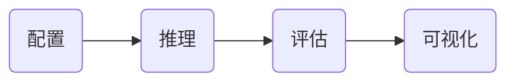

reference: [https://github.com/InternLM/tutorial/blob/main/opencompass/opencompass_tutorial.md](https://github.com/InternLM/tutorial/blob/main/opencompass/opencompass_tutorial.md)

# 一、评估的现状

- 斯坦福大学提出了较为系统的<font color=darkred>评测**框架**HELM</font>
  - 从准确性，安全性，鲁棒性和公平性等维度开展模型评测
- 纽约大学联合谷歌和Meta提出了<font color=darkred>SuperGLUE**评测集**</font>
  - 从推理能力，常识理解，问答能力等方面入手，构建了包括8个子任务的大语言模型评测数据集。
- 加州大学伯克利分校提出了<font color=darkred>MMLU**测试集**</font>
  - 构建了涵盖高中和大学的多项考试，来评估模型的知识能力和推理能力
- 谷歌也提出了<font color=darkred>Big-Bench**评测集**</font>
  - 包含数理科学，编程代码，阅读理解，逻辑推理等子任务
  - 涵盖200多个子任务，对模型能力进行系统化的评估
- 中文评测方面，国内的学术机构也提出了如<font color=darkred>CLUE,CUGE等**评测集**</font>
  - 从文本分类，阅读理解，逻辑推理等方面评测语言模型的中文能力


目前学术界和工业界的评测方案往往只关注模型的部分能力维度，缺少系统化的能力维度框架与评测方案。`OpenCompass`提供设计一套**全面、高效、可拓展**的大模型评测方案，对模型能力、性能、安全性等进行全方位的评估。`OpenCompass`提供分布式自动化的评测系统，支持对(语言/多模态)大模型开展全面系统的能力评估。


# 二、OpenCompass介绍

> 6大维度，80+评测集，40万+评测题目  
> 唯一国内开发者主要开发的大模型评测工具  
> Meta推荐的评测工具之一

## 2.1 评测对象

本算法库的主要评测对象为语言大模型与多模态大模型。我们以语言大模型为例介绍评测的具体模型类型。

**基座模型：**一般是经过海量的文本数据以自监督学习的方式进行训练获得的模型（如OpenAI的GPT-3，Meta的LLaMA），往往具有强大的文字续写能力。

**对话模型：**一般是在的基座模型的基础上，经过指令微调或人类偏好对齐获得的模型（如OpenAI的ChatGPT、上海人工智能实验室的书生·浦语），能理解人类指令，具有较强的对话能力。


# 三、快速开始


1. 配置 `configs/eval_demo.py`
   -  选择要评估的模型和数据集
   -  选择评估策略、计算后端等
   -  定义显示结果的方式
2. 推理与评估
   - 对模型和数据集进行并行推理和评估
   - 推理: 让模型从数据集产生输出
   - 评估: 衡量这些输出与标准答案的匹配程度
3. 可视化
   - 结果整理成易读的表格, 将其保存为 CSV 和 TXT 文件
   - 也可以激活飞书状态上报功能，此后可以在飞书客户端中及时获得评测状态报告

## 3.1 安装与准备

1. 安装`opencompass`
```shell
git clone https://github.com/open-compass/opencompass
cd opencompass
pip install -e .
```
2. 数据准备
3. 查看支持的数据集和模型`python tools/list_configs.py internlm ceval` | `python tools/list_configs.py internlm2 ceval`
   - 已经支持internlm2 (`2024-01-21`)
4. 启动评测 `python run.py  ...`
   - `run.py`  是clone的`opencompass`目录下的文件
   - 一般要求**运行环境网络是可用**

|参数| 参数示例| 备注 |
|-|-|-|
|--datasets | ceval_gen | 测试数据集 |
|--hf-path  | /share/temp/model_repos/internlm-chat-7b/ | HuggingFace 模型路径 |
|--tokenizer-path | /share/temp/model_repos/internlm-chat-7b/ | HuggingFace tokenizer 路径（如果与模型路径相同，可以省略） |
|--tokenizer-kwargs | padding_side='left' truncation='left' trust_remote_code=True | 构建 tokenizer 的参数 |
|--model-kwargs | device_map='auto' trust_remote_code=True |  构建模型的参数 |
|--max-seq-len | 2048 | 模型可以接受的最大序列长度 |
|--max-out-len | 16 | 生成的最大 token 数 |
|--batch-size  | 4  | 批量大小 |
|--num-gpus | 1  | 运行模型所需的 GPU 数量 |
|--debug    | | 该模式下任务将按顺序执行，并实时打印输出 |


## 3.2 自定义启动评测

除了直接用上述的方式进行启动评测  
还可以通过直接传递配置文件进行评测`python run.py configs/eval_demo.py`。

1. `configs/eval_demo.py`通过 继承机制 引入所需的数据集和模型配置
   - 数据集配置通常有两种类型：'ppl' 和 'gen'，分别指示使用的评估方法。其中 **`ppl` 表示辨别性评估**，**`gen` 表示生成性评估**。
   - `configs/datasets/collections`收录了各种数据集集合，方便进行综合评估
     - OpenCompass一般用`configs/datasets/collections/base_medium.py`进行全面的模型测试
     - `python run.py --models hf_llama_7b --datasets base_medium`
   - 模型
     - 在`configs/models/opt` 下进行创建：参考`configs/models/opt/hf_opt_350m.py`
     - 也可以在`eval_demo.py`中直接创建，参考`opencompass/configs/eval_internlm_chat_7b_turbomind.py`
  

```python
# hf_opt_350m.py
from opencompass.models import HuggingFaceCausalLM

# OPT-350M
opt350m = dict(
       type=HuggingFaceCausalLM,
       # `HuggingFaceCausalLM` 的初始化参数
       path='facebook/opt-350m',
       tokenizer_path='facebook/opt-350m',
       tokenizer_kwargs=dict(
           padding_side='left',
           truncation_side='left',
           proxies=None,
           trust_remote_code=True),
       model_kwargs=dict(device_map='auto'),
       
       # 下面是所有模型的共同参数，不特定于 HuggingFaceCausalLM
       abbr='opt350m',                   # 结果显示的模型缩写
       max_seq_len=2048,                 # 整个序列的最大长度        
       max_out_len=100,                  # 生成的最大 token 数
       batch_size=64,                    # 批量大小
       run_cfg=dict(num_gpus=1),         # 该模型所需的 GPU 数量
)
models = [opt350m]
```

## 3.3 可视化评估结果

结果位置tree
```text
(opencompass) root@intern-studio:~/opencompass/opencompass/outputs/default/20240121_132344# tree .
.
|-- configs
|   `-- 20240121_132344.py
|-- predictions
|   `-- opencompass.models.huggingface.HuggingFace_Shanghai_AI_Laboratory_internlm2-chat-7b
|       |-- ceval-accountant.json
|       |-- ceval-advanced_mathematics.json
...
|       |-- ceval-urban_and_rural_planner.json
|       `-- ceval-veterinary_medicine.json
|-- results
|   `-- opencompass.models.huggingface.HuggingFace_Shanghai_AI_Laboratory_internlm2-chat-7b
|       |-- ceval-accountant.json
|       |-- ceval-advanced_mathematics.json
....
|       |-- ceval-urban_and_rural_planner.json
|       `-- ceval-veterinary_medicine.json
`-- summary
    |-- summary_20240121_132344.csv
    `-- summary_20240121_132344.txt
```


