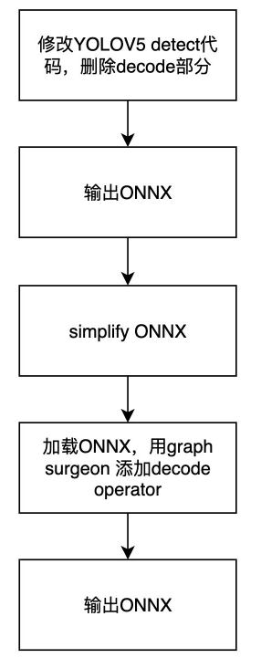

# 1. YoloV5-train

download path: /home/scc/sccWork/openProject/yolov5

## 1.1 data prepare
```bash
. 工作路径
├── datasets
│   └── person_data
│       ├── images
│       │   ├── train
│       │   │   └── demo_001.jpg
│       │   └── val
│       │       └── demo_002.jpg
│       └── labels
│           ├── train
│           │   └── demo_001.txt
│           └── val
│               └── demo_002.txt
└── yolov5
```

## 1.2 Config

### data config
复制`yolov5/data/coco128.yaml`一份，比如为`coco_person.yaml`

```yaml
# Train/val/test sets as 1) dir: path/to/imgs, 2) file: path/to/imgs.txt, or 3) list: [path/to/imgs1, path/to/imgs2, ..]
path: ../datasets/person_data  # 数据所在目录
train: images/train  # 训练集图片所在位置（相对于path）
val:  images/val # 验证集图片所在位置（相对于path）
test:  # 测试集图片所在位置（相对于path）（可选）

# 类别
nc: 5  # 类别数量
names: ['pedestrians','riders','partially-visible-person','ignore-regions','crowd'] # 类别标签名
```

### model config

> 官方权重下载地址：https://github.com/ultralytics/yolov5
复制`models`下对应模型的`yaml`文件，重命名，比如课程另存为`yolov5s_person.yaml`，并修改其中：

```shell
# nc: 80  # 类别数量
nc: 5  # number of classes
```

## 1.3 train
> wandb: https://wandb.ai/296294812/yolo_person_s?workspace=user-296294812

```shell
# yolov5s 
python ./train.py --data ./data/coco_person.yaml --cfg ./models/yolov5s_person.yaml --weights ./weights/yolov5s.pt --batch-size 32 --epochs 120 --workers 0 --name s_120 --project yolo_person_s
```


# 2. yolov5 export -> ONNX

## 2.1 working principle

`tensort decode plugin` replace `yolov5 decode`: If not replaced, this part of the operation will affect overall performance

- export yolov5 model onnx
- add plugin operator with tensorrt

progressing:



## 2.2 fix yolov5 code，export ONNX

```bash
# 将patch复制到yolov5文件夹
cp export.patch yolov5/
# 进入yolov5文件夹
cd yolov5/
# 应用patch
git am export.patch
```

install python package
```bash
pip install seaborn
pip install onnx-graphsurgeon
# pip install nvidia-pyindex
# pip install onnx-graphsurgeon
pip install onnx-simplifier==0.3.10

apt update
apt install -y libgl1-mesa-glx

```
export
```bash
python export.py --weights weights/yolov5s.pt --include onnx --simplify --dynamic
```

## 2.3 code detail

`export.patch`
